# Orakel Pipeline — Dagster DAG

```mermaid
%%{init: {
  'theme': 'base',
  'themeVariables': {
    'primaryColor': '#1a1a2e',
    'primaryTextColor': '#e0e0e0',
    'primaryBorderColor': '#16213e',
    'lineColor': '#4a4a6a',
    'secondaryColor': '#0f3460',
    'tertiaryColor': '#16213e',
    'clusterBkg': '#0d1b2a',
    'clusterBorder': '#1b2838'
  }
}}%%

graph TD

  %% ─── External Sources ───
  subgraph EXTERNAL["☁️  Fuentes Externas"]
    direction LR
    RAIDERIO["Raider.IO API<br/><small>REST · 2000 runs</small>"]:::external
    WCL["WarcraftLogs API<br/><small>GraphQL · 286 reports</small>"]:::external
  end

  %% ─── Bronze Layer ───
  subgraph BRONZE["🥉 Bronze — Ingesta"]
    direction TB
    CHK["check_minio_state<br/><small>Health check MinIO</small>"]:::bronze
    BRONZE_RIO["bronze_rio<br/><small>Ingesta Raider.IO</small>"]:::bronze
    MATCH["match_manifest<br/><small>Fuzzy join 3-capas</small>"]:::bronze
    BRONZE_WCL["bronze_wcl<br/><small>Ingesta WCL:<br/>DamageTaken · Healing · Interrupts</small>"]:::bronze

    CHK --> BRONZE_RIO
    BRONZE_RIO --> MATCH
    CHK --> BRONZE_WCL
    MATCH --> BRONZE_WCL
  end

  %% ─── Silver Layer ───
  subgraph SILVER["🥈 Silver — Limpieza + Integración"]
    direction TB
    SILVER_RIO["silver_raiderio<br/><small>Clean + dedup Raider.IO</small>"]:::silver
    SILVER_RUNS["silver_dungeon_runs<br/><small>Enriquecer runs con WCL</small>"]:::silver
    SILVER_PP["silver_player_performance<br/><small>Stats por jugador</small>"]:::silver

    BRONZE_RIO --> SILVER_RIO
    SILVER_RIO --> SILVER_RUNS
    MATCH --> SILVER_RUNS
    BRONZE_WCL --> SILVER_RUNS
    SILVER_RUNS --> SILVER_PP
  end

  %% ─── Gold Layer ───
  subgraph GOLD["🥇 Gold — KPIs + Dimensiones"]
    direction TB

    %% Dimensions
    DIM_DUNGEON["gold_dim_dungeon<br/><small>Dungeon timers</small>"]:::gold
    DIM_PLAYER["gold_dim_player<br/><small>Player dimension</small>"]:::gold
    DIM_AFFIX["gold_dim_affix<br/><small>Affix metadata</small>"]:::gold
    DIM_SPEC["gold_dim_spec<br/><small>Spec → Role mapping</small>"]:::gold

    %% KPIs
    KPI_DC["gold_kpi_death_clock<br/><small>KPI 1: Tank Death Clock</small>"]:::gold
    KPI_HD["gold_kpi_healer_deficit<br/><small>KPI 2: Healer Deficit</small>"]:::gold
    KPI_IR["gold_kpi_interrupt_rate<br/><small>KPI 3: Interrupt Rate</small>"]:::gold
    KPI_SY["gold_kpi_synergy<br/><small>KPI 4: Comp Synergy</small>"]:::gold

    SILVER_RIO --> DIM_DUNGEON
    SILVER_RIO --> DIM_PLAYER
    SILVER_RIO --> DIM_AFFIX
    SILVER_RIO --> DIM_SPEC
    SILVER_RIO --> KPI_SY

    SILVER_PP --> KPI_DC
    SILVER_PP --> KPI_HD
    SILVER_PP --> KPI_IR
  end

  %% ─── ML Layer ───
  subgraph ML["🤖 ML — Feature Engineering + Modelo"]
    direction TB
    FEATURES["gold_features<br/><small>Feature engineering:<br/>log1p · role counts ·<br/>affix flags · one-hot</small>"]:::ml
    MODEL["ml_model<br/><small>Ridge Regression<br/>MLflow + MinIO</small>"]:::ml

    KPI_DC --> FEATURES
    KPI_HD --> FEATURES
    KPI_IR --> FEATURES
    KPI_SY --> FEATURES
    FEATURES --> MODEL
  end

  %% ─── Storage ───
  subgraph STORAGE["💾 Almacenamiento (MinIO S3)"]
    direction LR
    MINIO_BRONZE["🥉 Bronze<br/>Parquet"]:::storage
    MINIO_SILVER["🥈 Silver<br/>Parquet"]:::storage
    MINIO_GOLD["🥇 Gold<br/>Parquet"]:::storage
    MINIO_MODEL["🤖 Modelos<br/>MLflow + pickle"]:::storage
  end

  %% ─── Asset Checks ───
  subgraph CHECKS["✅ Asset Checks (Validaciones)"]
    direction TB
    C_BRONZE["bronze_rio_checks"]:::check
    C_SR["silver_raiderio_checks"]:::check
    C_SDR["silver_dungeon_runs_checks"]:::check
    C_SPP["silver_player_performance_checks"]:::check
    C_KDC["gold_kpi_death_clock_check"]:::check
    C_KHD["gold_kpi_healer_deficit_check"]:::check
    C_KIR["gold_kpi_interrupt_rate_check"]:::check
    C_KSY["gold_kpi_synergy_check"]:::check
    C_GF["gold_features_check"]:::check
  end

  %% ─── Connections to external sources ───
  RAIDERIO -.-> BRONZE_RIO
  WCL -.-> BRONZE_WCL

  %% ─── Connections to storage ───
  BRONZE_RIO -.-> MINIO_BRONZE
  BRONZE_WCL -.-> MINIO_BRONZE
  SILVER_RIO -.-> MINIO_SILVER
  SILVER_RUNS -.-> MINIO_SILVER
  SILVER_PP -.-> MINIO_SILVER
  DIM_DUNGEON -.-> MINIO_GOLD
  DIM_PLAYER -.-> MINIO_GOLD
  DIM_AFFIX -.-> MINIO_GOLD
  DIM_SPEC -.-> MINIO_GOLD
  KPI_DC -.-> MINIO_GOLD
  KPI_HD -.-> MINIO_GOLD
  KPI_IR -.-> MINIO_GOLD
  KPI_SY -.-> MINIO_GOLD
  FEATURES -.-> MINIO_GOLD
  MODEL -.-> MINIO_MODEL

  %% ─── Connections from assets to checks ───
  BRONZE_RIO -.- C_BRONZE
  SILVER_RIO -.- C_SR
  SILVER_RUNS -.- C_SDR
  SILVER_PP -.- C_SPP
  KPI_DC -.- C_KDC
  KPI_HD -.- C_KHD
  KPI_IR -.- C_KIR
  KPI_SY -.- C_KSY
  FEATURES -.- C_GF

  %% ─── Styles ───
  classDef external fill:#e94560,color:#fff,stroke:#c73e54,stroke-width:2px
  classDef bronze fill:#6b4226,color:#fff,stroke:#8b5a2b,stroke-width:2px
  classDef silver fill:#555,color:#fff,stroke:#777,stroke-width:2px
  classDef gold fill:#b8860b,color:#fff,stroke:#daa520,stroke-width:2px
  classDef ml fill:#1a5276,color:#fff,stroke:#2e86c1,stroke-width:2px
  classDef storage fill:#1b4332,color:#fff,stroke:#2d6a4f,stroke-width:2px
  classDef check fill:#2d2d2d,color:#aaa,stroke:#444,stroke-width:1px,dashed
```



### 📋 Dependencias y Tareas Paralelas

| Tareas que DEBEN ser secuenciales | Tareas que pueden ser PARALELAS |
|-----------------------------------|--------------------------------|
| `check_minio_state → bronze_rio` | `bronze_rio ↔ match_manifest` (no, match depende de bronze_rio) |
| `bronze_rio → match_manifest` | `dim_dungeon, dim_player, dim_affix, dim_spec` (todas dependen solo de silver_raiderio) |
| `bronze_rio → silver_raiderio` | `kpi_death_clock, kpi_healer_deficit, kpi_interrupt_rate` (dependen de silver_player_performance) |
| `match_manifest → bronze_wcl` | `kpi_synergy` se ejecuta en paralelo con los otros 3 KPIs (depende solo de silver_raiderio) |
| `silver_raiderio → gold_dim_*` | |
| `silver_player_performance → kpi_*` | |
| `kpi_* → gold_features → ml_model` | **CUello de botella**: gold_features necesita los 4 KPIs antes de arrancar |

### 🧵 Ruta Crítica

La ruta más larga (secuencial obligatoria) que determina el tiempo total del pipeline:

```
check_minio_state → bronze_rio → match_manifest → bronze_wcl
                                                          ↓
bronze_rio → silver_raiderio → silver_dungeon_runs → silver_player_performance
                                                          ↓
                                            kpi_death_clock, kpi_healer_deficit, kpi_interrupt_rate
                                                          ↓
                                                  gold_features → ml_model
```

Además, `kpi_synergy` (depende solo de `silver_raiderio`) y `gold_dim_*` se ejecutan en paralelo al bloque de KPIs que depende de `silver_player_performance`.

### 📌 Justificación de Spark

**¿Por qué Spark y no pandas?**

1. **Volumen de datos**: La capa Bronze acumula ~515.000 filas entre DamageTaken (28K), Healing (108K) e Interrupts (378K). Pandas cargaría todo en memoria de un nodo.
2. **Transformaciones distribuidas**: Las Window functions para ranking por afinidad en el fuzzy join (`silver.py`) requieren particionamiento por dungeon + key_level.
3. **UDFs para lógica de negocio**: El parseo de `comp_signature` para extraer tank/healer/dps usa UDFs que se ejecutan en cada worker.
4. **Agregaciones complejas**: Los KPIs de Gold requieren agrupar por `run_id`, `tank_name`, `healer_name`, `player_name` — operaciones que Spark particiona y paraleliza naturalmente.
5. **Integración con MinIO**: PySpark lee/escribe Parquet directamente vía S3A, sin necesidad de mover datos al driver.
