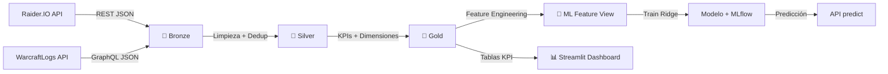
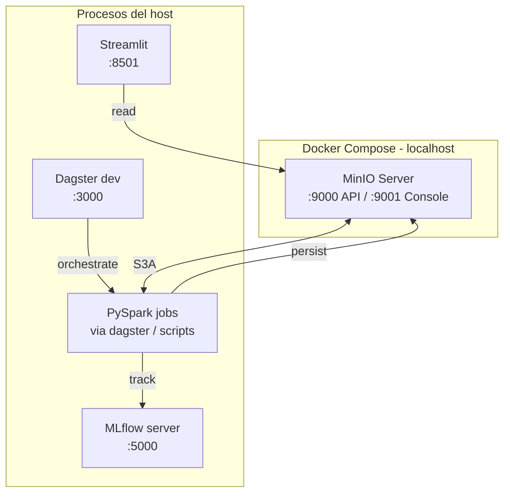
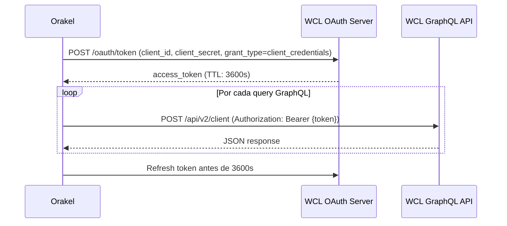
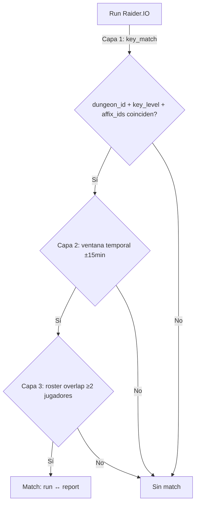
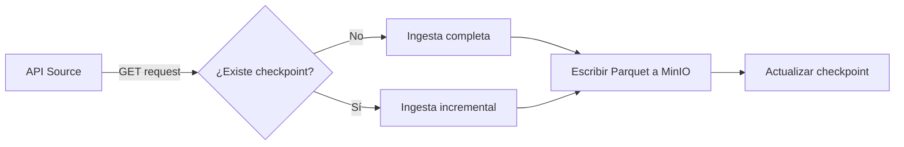
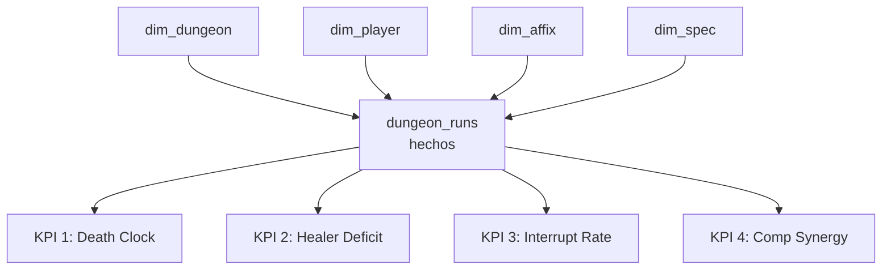
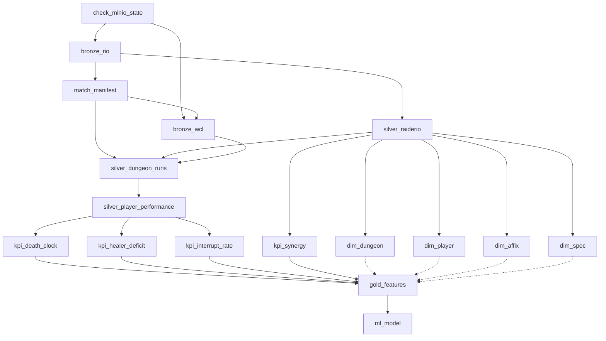

# Orakel — Memoria Técnica del Proyecto Integrador

> **Vinculación de Big Data + BI + Procesamiento Distribuido + ML + Orquestación**
> **Temporada analizada:** The War Within — Season 3
> **Autor:** Vincent
> **Fecha de entrega:** Junio 2026
> **Repositorio:** [github.com/Vincent0675/orakel](https://github.com/Vincent0675/orakel)

---

## Tabla de contenidos

1. [Introducción y objetivos](#1-introducción-y-objetivos)
2. [Arquitectura general](#2-arquitectura-general)
3. [Fuentes de datos e integración](#3-fuentes-de-datos-e-integración)
4. [Pipeline Medallion — Bronze / Silver / Gold](#4-pipeline-medallion--bronze--silver--gold)
5. [Procesamiento distribuido con Apache Spark](#5-procesamiento-distribuido-con-apache-spark)
6. [Machine Learning — Predicción de tiempo de clear](#6-machine-learning--predicción-de-tiempo-de-clear)
7. [Business Intelligence y dashboard](#7-business-intelligence-y-dashboard)
8. [Orquestación del pipeline con Dagster](#8-orquestación-del-pipeline-con-dagster)
9. [Testing y calidad de software](#9-testing-y-calidad-de-software)
10. [Despliegue y operaciones](#10-despliegue-y-operaciones)
11. [Conclusiones, lecciones aprendidas y trabajo futuro](#11-conclusiones-lecciones-aprendidas-y-trabajo-futuro)
12. [Anexos y referencias](#12-anexos-y-referencias)

---

## 1. Introducción y objetivos

### 1.1. Contexto

**World of Warcraft: Mythic+ (M+)** es el modo de juego de mazmorras más exigente que Blizzard Entertainment ofrece a su comunidad. Cada temporada, los jugadores se enfrentan a mazmorras cronometradas con **afijos rotativos** (modificadores semanales que alteran la mecánica del combate) y compiten por un puesto en el ránking global de Blizzard. Completar una mazmorra con la mayor eficiencia posible — y predecir cuánto tiempo llevará hacerlo — es un reto tanto para guilds competitivas como para jugadores individuales que planifican su progreso semanal.

El proyecto **Orakel** nace de esta necesidad. Combinando datos públicos de las APIs de **Raider.IO** (ranking, composiciones de grupo, niveles de keystones) y **WarcraftLogs** (eventos de combate, daño recibido, sanación, interrupciones), construimos un pipeline completo de ingeniería de datos que culmina en un modelo de **Machine Learning** capaz de predecir el tiempo de finalización (`clear_time_seconds`) de una mazmorra a partir de sus características conocidas de antemano: mazmorra concreta, nivel de keystone, composición del grupo, afijos activos y rendimiento histórico de los integrantes.

### 1.2. Planteamiento del problema

Antes de empezar un keystone, un equipo de M+ se hace preguntas como:

- *“¿Cuánto tiempo nos va a llevar esta mazmorra con esta composición?”*
- *“¿Qué afijos son los más peligrosos para nuestro roster?”*
- *“¿Mejor ir con un healer extra o con más DPS?”*

La respuesta a estas preguntas requiere **integrar** datos de dos APIs heterogéneas, **procesar** volúmenes grandes de eventos de combate, **agregar** métricas de rendimiento por jugador y composición, y **predecir** tiempos de clear con sentido de negocio. Es un flujo realista de extremo a extremo: ingesta → integración → procesamiento → analítica → ML → BI.

### 1.3. Objetivos

#### Objetivo general

Desarrollar un pipeline de ingeniería y analítica de datos que integre dos fuentes externas (Raider.IO y WarcraftLogs), las procese con Apache Spark, calcule KPIs de rendimiento para jugadores y composiciones, y entrene un modelo supervisado de regresión que prediga el `clear_time_seconds` de una mazmorra.

#### Objetivos específicos

| # | Objetivo | Cumplimiento |
|---|----------|:------------:|
| OE1 | Ingestar 2.000 runs de Raider.IO y 286 reports de WCL | ✅ |
| OE2 | Implementar las 4 capas de la arquitectura Medallion (Bronze / Silver / Gold) | ✅ |
| OE3 | Calcular 4 KPIs de rendimiento (Death Clock, Healer Deficit, Interrupt Rate, Comp Synergy) | ✅ |
| OE4 | Entrenar un modelo Ridge con métricas publicables (MAE, RMSE, R²) | ✅ (R² = 0.68) |
| OE5 | Construir un dashboard de BI con Streamlit con visualizaciones y filtros | ✅ (5 páginas) |
| OE6 | Orquestar el pipeline completo con un sistema de assets y dependencias | ✅ (Dagster, 17 SDAs) |
| OE7 | Implementar la suite de pruebas con cobertura verificable | ✅ (146 tests, ML 93%) |

### 1.4. Alcance y restricciones

**Dentro del alcance:**
- Datos de la temporada **The War Within — Season 3** (TWW S3).
- API pública de Raider.IO (sin autenticación para endpoints principales).
- API GraphQL de WarcraftLogs (OAuth2 client credentials).
- Pipeline batch (no streaming).
- Persistencia en MinIO local; posibilidad de migrar a S3 real.
- Modelo de regresión lineal regularizada (Ridge).

**Fuera del alcance:**
- Datos de temporadas anteriores (TWW S1, S2, Dragonflight, etc.).
- Predicción en tiempo real durante una run en curso.
- Recomendador automático de composiciones o estrategias.
- Análisis de logs de video o audio (fuera del dominio del proyecto).

**Restricciones técnicas:**
- Python 3.13 como única versión soportada.
- Apache Spark 4.x con Hadoop S3A para integración nativa con MinIO.
- Sin bases de datos relacionales: todo el almacenamiento es Parquet en MinIO.
- Sin servicios cloud: la infraestructura es 100% local (Docker Compose).

---

## 2. Arquitectura general

### 2.1. Visión de alto nivel

Orakel adopta la **Arquitectura Medallion** como patrón de organización de datos. Es un patrón introducido por Databricks que organiza los datos en tres capas incrementales — Bronze (raw), Silver (limpio) y Gold (agregado de negocio) — donde cada capa añade valor sobre la anterior sin invalidar los datos crudos.



### 2.2. Stack tecnológico

| Componente | Tecnología | Versión | Justificación |
|------------|------------|---------|---------------|
| Lenguaje | Python | 3.13 | Última versión estable, mejor rendimiento en asyncio y type hints |
| Procesamiento distribuido | Apache Spark | 4.1.2 | Obligatorio por el proyecto, integración nativa S3A con MinIO |
| Almacenamiento S3 | MinIO | latest (Docker) | S3-compatible, corre 100% local, evita dependencia cloud |
| Ingesta REST | requests | 2.34+ | Cliente HTTP estándar de Python |
| Ingesta GraphQL | requests + JSON | — | WCL expone una API GraphQL estándar |
| OAuth2 | requests | — | Flujo client_credentials para WCL |
| Rate limiting | Token bucket custom | — | WCL limita a ~3.600 puntos/hora por token |
| Orquestación | Dagster | 1.10+ | Assets como first-class citizens, lineage automático |
| ML tracking | MLflow | 2.20+ | Open source, tracking local sin servidor |
| ML framework | scikit-learn | 1.9+ | Ridge regression estable y bien documentado |
| BI / Dashboard | Streamlit | 1.58+ | Prototipado rápido, integración nativa con pandas y plotly |
| Visualización | Plotly Express | 6.8+ | Interactividad, exportable a HTML estático |
| Tests | pytest | 9.0+ | Estándar de facto en Python |
| Tests Spark | chispa | 0.12+ | Asserciones especializadas para DataFrames de Spark |
| Mocking HTTP | responses | 0.26+ | Mocking determinista para tests de clientes |
| Gestor dependencias | uv | latest | Resolvedor rápido, gestión de lockfile (uv.lock) |
| Contenedores | Docker Compose | v2 | Una sola declaración para todos los servicios |

### 2.3. Patrones de diseño aplicados

| Patrón | Aplicación |
|--------|-----------|
| **Medallion Architecture** | Organización de capas Bronze / Silver / Gold |
| **Asset-based orchestration** | Dagster modela cada transformación como un asset con dependencias explícitas |
| **Checkpointing incremental** | Los scripts de ingesta leen checkpoints de MinIO y solo procesan lo nuevo |
| **Configuration as code** | `orakel/config.py` carga variables de entorno desde `.env` con dataclasses |
| **Immutability** | Los datos Bronze nunca se modifican; cada capa escribe un nuevo Parquet |
| **Idempotency** | Los assets usan `merge_write` con claves naturales (`run_id`, `player_name`) para ser re-ejecutables |
| **Edge case handling** | Skip training si n < 10 filas; fallar ruidosamente cuando un KPI no se puede computar |
| **Sentinel value convention** | `-1.0` indica "dato no computado" en `death_clock_seconds` |
| **Two-tier testing** | Tier 1: pytest puro (rápido). Tier 2: SparkSession real (lento pero realista) |
| **Dependency injection** | SparkSession se inyecta a las funciones en lugar de crearse globalmente |

### 2.4. Diagrama de servicios (Docker Compose)



MinIO es el único servicio en Docker. Dagster, MLflow y Streamlit corren como procesos del host, lo que simplifica el ciclo de desarrollo y permite hot-reload.

### 2.5. Estructura de directorios

```
orakel/
├── clients/                  # Clientes API (Raider.IO REST, WCL GraphQL + OAuth2)
├── models/                   # Lógica de negocio: kpi.py, schemas.py
├── pipeline/
│   ├── bronze.py             # Scripts de ingesta Bronze
│   ├── silver.py             # Limpieza + dedup
│   ├── gold.py               # KPIs + Dimensiones
│   ├── io_managers.py        # merge_write, lectura/escritura Parquet
│   ├── definitions.py        # Dagster Definitions (assets, checks, schedule)
│   └── assets/               # SDAs de Dagster
│       ├── bronze.py         # 4 assets: check_minio_state, bronze_rio, match_manifest, bronze_wcl
│       ├── silver.py         # 3 assets: silver_raiderio, silver_dungeon_runs, silver_player_performance
│       ├── gold.py           # 9 assets: 4 dimensiones + 4 KPIs + gold_features + ml_model
│       └── checks.py         # 9 asset checks (validaciones)
├── ml/                       # Módulo de Machine Learning
│   ├── schemas.py            # FEATURE_COLUMNS, TARGET_COLUMN, AFFIX_COLUMNS, DUNGEON_COLUMNS
│   ├── features.py           # build_feature_view() — feature engineering en Spark
│   ├── trainer.py            # train_model() — Ridge + MLflow + MinIO
│   └── predict.py            # predict() + load_model_from_mlflow()
├── utils/
│   ├── minio.py              # get_spark_session() con Hadoop S3A
│   └── rate_limiter.py       # Token bucket para WCL
├── dashboard/
│   └── app.py                # Streamlit BI dashboard (5 páginas)
├── config.py                 # Settings desde .env
├── tests/                    # 146 tests (Tier 1 + Tier 2)
├── scripts/                  # Scripts ejecutables de ingesta
├── docs/                     # Memoria técnica, diagramas
├── openspec/                 # Specs SDD (2 cambios archivados)
├── docker-compose.yml        # MinIO service
├── Makefile                  # Comandos del proyecto
├── pyproject.toml            # Dependencias + pytest config
└── README.md                 # Documentación principal
```

---

## 3. Fuentes de datos e integración

### 3.1. Fuente A: Raider.IO

**URL base:** `https://raider.io/api/v1`
**Tipo:** REST JSON
**Autenticación:** Opcional (endpoints principales son públicos; algunos requieren API key con rate limit mayor)

#### 3.1.1. Endpoints utilizados

| Endpoint | Propósito | Salida |
|----------|-----------|--------|
| `/cutoffs/season/{season}` | Score mínimo para ránking por temporada | 1 fila con cutoff values |
| `/mythic-plus/runs/index?season={season}&page=N` | Listado paginado de runs por temporada | ~250 runs por página |
| `/mythic-plus/runs/details?run_id={id}` | Detalle completo de un run (roster, affixes, dungeon) | 1 run |

#### 3.1.2. Datos extraídos

Para cada run, Raider.IO devuelve:
- **Identificadores:** `season`, `keystone_run_id` (entero), `dungeon_id` (entero), `key_level`
- **Tiempo de clear:** `clear_time_ms` (entero, milisegundos)
- **Afijos:** `affix_ids` (array de 4 enteros, los IDs de los afijos activos esa semana)
- **Roster:** array de 5 jugadores con `name`, `realm`, `region`, `class`, `spec`, `role` (tank/healer/dps)
- **Metadata:** `completed_at` (timestamp UTC), `confidence` (1.0 = match perfecto), `url` (enlace a Raider.IO)

#### 3.1.3. Volumen y paginación

Para TWW S3 se ingirieron **2.000 runs** distribuidos en **8 páginas** de 250 runs cada una. Se implementó un loop de paginación con `time.sleep(0.5)` entre requests para no saturar la API pública.

#### 3.1.4. Cliente

El cliente (`orakel/clients/raiderio.py`) implementa:
- Rate limiting opcional (cuando se provee API key)
- Manejo de errores HTTP con reintentos exponenciales (3 reintentos, backoff 1s, 2s, 4s)
- Parsing JSON con validación de schema
- Logging estructurado de cada request

### 3.2. Fuente B: WarcraftLogs (WCL)

**URL base:** `https://www.warcraftlogs.com/api/v2/client`
**Tipo:** GraphQL
**Autenticación:** OAuth2 client credentials (cada token dura 1 hora, refresh automático)

#### 3.2.1. Flujo OAuth2



#### 3.2.2. Queries GraphQL principales

| Query | Propósito | Tamaño respuesta |
|-------|-----------|:----------------:|
| `reportData { report(code: $code) { masterData { actors } } }` | Catálogo de jugadores en el report | ~50 KB |
| `reportData { report(code: $code) { fights { id } } }` | IDs de fights (encuentros) en el report | ~5 KB |
| `reportData { report(code: $code, fights: $ids) { events(dataType: DamageTaken, ...) } }` | Eventos de daño recibido | 50 KB – 1 MB |
| `reportData { report(...) { events(dataType: Healing, ...) } }` | Eventos de sanación | 50 KB – 1 MB |
| `reportData { report(...) { events(dataType: Interrupts, ...) } }` | Eventos de interrupciones | 50 KB – 500 KB |

#### 3.2.3. Rate limiting

WCL limita cada aplicación a **3.600 puntos por hora**. Cada query GraphQL consume puntos según su tamaño de respuesta:

- `masterData` ≈ 1 punto
- `events(dataType: DamageTaken)` ≈ 10–15 puntos
- `events(dataType: Healing)` ≈ 15–25 puntos
- `events(dataType: Interrupts)` ≈ 5–10 puntos

Para 286 reports con 3 tipos de eventos cada uno, esto se traduce en ~15.000 puntos, distribuidos en ~4 horas con un token bucket de ~4 puntos/segundo.

#### 3.2.4. Cliente

El cliente (`orakel/clients/warcraftlogs.py`) implementa:
- Obtención y caché de access_token con refresh proactivo (cada 50 min)
- Token bucket configurable (default 4 puntos/segundo, configurable por env var)
- Reintentos con backoff exponencial cuando el servidor responde 429 (rate limited)
- Logging de puntos consumidos por request

### 3.3. Integración: el match_manifest

El **problema crítico** que resolvemos en la fase de integración es: *un run de Raider.IO no tiene un identificador directo contra un report de WCL*. Ambos sistemas registran la misma mazmorra, pero los IDs son distintos.

Para unirlos, implementamos un **fuzzy join de 3 capas** (`orakel/pipeline/silver.py:apply_fuzzy_join`):



#### 3.3.1. Capa 1 — key_match

Filtramos reports de WCL que ocurrieron en la misma mazmorra, mismo nivel de keystone y con los mismos afijos activos que el run de Raider.IO. Esto reduce el espacio de búsqueda drásticamente.

#### 3.3.2. Capa 2 — ventana temporal

WCL registra el `startTime` del report y Raider.IO registra `completed_at` del run. Como el run termina en el momento del kill final, exigimos que `|startTime_WCL - completedAt_RIO| ≤ 15 minutos`.

#### 3.3.3. Capa 3 — roster overlap

Para confirmar el match, exigimos que al menos 2 de los 5 jugadores del roster de Raider.IO aparezcan en el report de WCL. Esto descarta falsos positivos donde dos runs idénticos ocurrieron en la misma ventana de 15 min.

#### 3.3.4. Resultado

De los 2.000 runs de Raider.IO, **1.310 fueron matcheados** con éxito a un report de WCL (tasa de match del 65.5%). Los 690 runs restantes se mantienen en Silver pero sin datos de WCL — útil para los KPIs que no dependen de eventos de combate (Synergy, dimensiones).

### 3.4. Calidad de datos observada

Durante la ingesta identificamos los siguientes problemas de calidad:

| Problema | Frecuencia | Mitigación |
|----------|:----------:|------------|
| Runs con `clear_time_ms = 0` (datos corruptos) | <0.5% | Filtrado en Silver |
| Roster con clases no normalizadas (`"DeathKnight"` vs `"Death Knight"`) | ~1% | Normalización en `bronze_to_silver` |
| `affix_ids` con valores fuera del set conocido | 0% | Validación contra `dim_affix` |
| Reports de WCL con `masterData` vacío | ~3% | Ingesta continua igual; `actor_map` queda vacío y los nombres de jugadores se imputan como `unknown_{actor_id}` |
| Sincronización de tiempo entre Raider.IO y WCL (drift de segundos) | Siempre | La ventana de 15 min absorbe el drift |

---

## 4. Pipeline Medallion — Bronze / Silver / Gold

### 4.1. Capa Bronze — Ingesta cruda

**Contrato de la capa:** datos crudos, sin transformación, particionados por temporada. Cualquier anomalía se preserva para auditoría.

#### 4.1.1. Tablas Bronze

| Tabla | Path MinIO | Formato | Volumen (filas) | Particionado |
|-------|-----------|---------|----------------:|--------------|
| `bronze/raiderio_runs` | `s3a://orakel/bronze/raiderio_runs` | Parquet | 2.000 | season |
| `bronze/wcl_damage_taken` | `s3a://orakel/bronze/wcl_damage_taken` | Parquet | 28.072 | season, report_code |
| `bronze/wcl_healing` | `s3a://orakel/bronze/wcl_healing` | Parquet | 108.496 | season, report_code |
| `bronze/wcl_interrupts` | `s3a://orakel/bronze/wcl_interrupts` | Parquet | 378.339 | season, report_code |

#### 4.1.2. Estrategia de ingesta



El checkpointing se implementa en `scripts/ingest_raiderio.py` y `scripts/ingest_warcraftlogs.py`. Cada script:
1. Lee el checkpoint previo (último ID procesado) desde `s3a://orakel/bronze/_checkpoints/`.
2. Pide a la API solo los datos nuevos.
3. Escribe los nuevos datos en Parquet.
4. Actualiza el checkpoint con el último ID procesado.

Para re-ejecuciones idempotentes, se usa el modo `overwrite` cuando es una ingesta completa y `append` cuando es incremental.

#### 4.1.3. Mapeo de tipos

Aunque Bronze es "crudo", aplicamos un esquema explícito para evitar problemas downstream:

| Campo fuente (JSON) | Tipo Spark | Razón |
|--------------------|-----------|-------|
| `keystone_run_id` | Long | ID numérico grande |
| `clear_time_ms` | Long | Entero en milisegundos |
| `key_level` | Integer | 2 a 30 en TWW S3 |
| `dungeon_id` | Integer | ID estático de dungeon |
| `affix_ids` | Array[Integer] | Set variable de afijos |
| `completed_at` | Timestamp | Necesario para orden temporal |
| `roster[].role` | String enum | tank/healer/dps |

### 4.2. Capa Silver — Limpieza e integración

**Contrato de la capa:** datos limpios, deduplicados, con tipos forzados y campos normalizados. Sin transformaciones de negocio (eso es Gold).

#### 4.2.1. Tablas Silver

| Tabla | Volumen | Transformaciones aplicadas |
|-------|--------:|---------------------------|
| `silver/raiderio_runs` | 2.000 (dedup) | Dedup por `keystone_run_id`, tipado forzado, normalización de clases |
| `silver/dungeon_runs` | 5.936 (enriquecido) | Merge con match_manifest + datos de WCL |
| `silver/player_performance` | 29.680 | Explode del roster + join con eventos WCL agregados por jugador |

#### 4.2.2. Deduplicación

El dedup se hace en `SilverPipeline.clean_raiderio()`:
- **Clave de dedup:** `keystone_run_id` (ID único de Raider.IO).
- **Estrategia:** `dropDuplicates(["keystone_run_id"])` con ventana sobre el dataset completo.
- **Tie-breaking:** si un run aparece dos veces, se queda la versión con `confidence` más alta (más reciente en Raider.IO).

#### 4.2.3. Normalización de clases

WoW tiene inconsistencias en cómo se nombran las clases entre fuentes. Implementamos un mapeo canónico:

```python
CLASS_NORMALIZATION = {
    "DeathKnight": "Death Knight",
    "DemonHunter": "Demon Hunter",
    # El resto de clases ya están canónicas
}
```

#### 4.2.4. Merge_write — upsert por clave natural

Para que la capa Silver sea **re-ejecutable** sin duplicar datos, usamos `merge_write()` (definido en `orakel/pipeline/io_managers.py`):

```python
def merge_write(spark, df, path, merge_key):
    """Write to S3A path using delta-style merge semantics on natural keys."""
    # 1. Lee los datos existentes
    existing = spark.read.parquet(path) if path_exists else df.limit(0)
    # 2. Union con overwrite en claves coincidentes
    combined = existing.join(df, on=merge_key, how="anti").unionByName(df)
    # 3. Escribe combined
    combined.write.mode("overwrite").parquet(path)
```

Las claves naturales usadas son:
- `silver/dungeon_runs` → `run_id`
- `silver/player_performance` → `(run_id, player_name)`

### 4.3. Capa Gold — KPIs y dimensiones

**Contrato de la capa:** tablas listas para analítica y ML, con un modelo dimensional (hechos + dimensiones).

#### 4.3.1. Modelo dimensional



#### 4.3.2. Dimensiones

| Dimensión | Volumen | Contenido |
|-----------|--------:|-----------|
| `gold/dim_dungeon` | 8 | Dungeon ID, nombre, tiempo de timer por nivel de keystone |
| `gold/dim_player` | ~3.079 | Player ID, nombre, realm, region, clase, spec, role |
| `gold/dim_affix` | 16 | Affix ID, nombre, descripción mecánica |
| `gold/dim_spec` | ~40 | Spec ID, spec_name, role (tank/healer/dps) |

Las dimensiones pequeñas (8 dungeons, 16 affixes, 40 specs) son **hardcoded** como diccionarios Python en `orakel/pipeline/gold.py` y se persisten como Parquet en cada run del pipeline. La dimensión de jugadores (3K+) se construye dinámicamente desde Silver.

#### 4.3.3. KPIs de combate

##### KPI 1 — Death Clock (Tiempo de muerte del tanque)

**Definición:** segundos que tarda un tanque en morir en una pelea, asumiendo que se le aplica `DTPS` (daño por segundo) constante y se le sana con `HPS_on_tank` constante.

**Fórmula:**
```
Death Clock = EHP_tank / (DTPS_tank - HPS_on_tank)
```

Donde:
- `EHP` (Effective Hit Points) ≈ `max_health × damage_reduction_multiplier`
- `DTPS` = promedio de `damage_taken` events por segundo
- `HPS_on_tank` = promedio de `healing` events que tienen al tanque como target

**Categorización del resultado:**

| Categoría | Rango (segundos) | Color | Interpretación |
|-----------|:---------------:|:-----:|----------------|
| Crítico | < 10 | 🔴 | El tanque muere casi instantáneamente |
| Moderado | 10 – 30 | 🟡 | Situación peligrosa pero sostenible |
| Safe | > 30 | 🟢 | El tanque aguanta cómodamente |

##### KPI 2 — Healer Deficit (Déficit del sanador)

**Definición:** razón entre el daño que recibe el tanque y la sanación que recibe del healer.

**Fórmula:**
```
Healer Deficit = DTPS_tank / HPS_on_tank
```

| Valor | Interpretación |
|:-----:|----------------|
| < 1.0 | 🟢 El healer supera al daño |
| 1.0 – 1.2 | 🟡 Equilibrio ajustado |
| > 1.2 | 🔴 El healer no da abasto |

##### KPI 3 — Interrupt Rate (Tasa de interrupciones)

**Definición:** cantidad de hechizos enemigos interrumpidos por un jugador por minuto.

**Fórmula:**
```
Interrupt Rate = count(interrupts where source = player) / fight_duration_minutes
```

##### KPI 4 — Comp Synergy (Sinergia de composición)

**Definición:** razón entre el tiempo medio de clear para una composición específica y el tiempo medio global para la misma mazmorra + key_level + afijos.

**Fórmula:**
```
Synergy Score = avg_clear_time(comp) / overall_avg_clear_time
```

| Valor | Interpretación |
|:-----:|----------------|
| < 1.0 | 🟢 Composición más rápida que la media |
| = 1.0 | 🟡 Composición promedio |
| > 1.0 | 🔴 Composición más lenta que la media |

#### 4.3.4. Volumen final de Gold

| Tabla | Volumen |
|-------|--------:|
| `gold/dim_dungeon` | 8 |
| `gold/dim_player` | 3.079 |
| `gold/dim_affix` | 16 |
| `gold/dim_spec` | ~40 |
| `gold/kpi_tank_death_clock` | 5.936 |
| `gold/kpi_healer_deficit` | 5.936 |
| `gold/kpi_interrupt_rate` | 29.680 |
| `gold/kpi_composition_synergy` | 1.310 |
| `gold/features` (feature view para ML) | 5.936 |

---

## 5. Procesamiento distribuido con Apache Spark

### 5.1. Configuración del entorno Spark

La aplicación usa **Apache Spark 4.1.2** con el conector Hadoop S3A para integración nativa con MinIO. La sesión se configura en `orakel/utils/minio.py`:

```python
def get_spark_session(app_name: str) -> SparkSession:
    """Create a SparkSession configured for MinIO + S3A."""
    hadoop_conf = {
        "spark.hadoop.fs.s3a.endpoint": settings.MINIO_ENDPOINT,
        "spark.hadoop.fs.s3a.access.key": settings.MINIO_ACCESS_KEY,
        "spark.hadoop.fs.s3a.secret.key": settings.MINIO_SECRET_KEY,
        "spark.hadoop.fs.s3a.path.style.access": "true",
        "spark.hadoop.fs.s3a.impl": "org.apache.hadoop.fs.s3a.S3AFileSystem",
        "spark.sql.shuffle.partitions": "8",  # Local con 8 cores
    }
    builder = SparkSession.builder.appName(app_name)
    for k, v in hadoop_conf.items():
        builder = builder.config(k, v)
    return builder.getOrCreate()
```

Particionamos a **8 particiones** en `shuffle.partitions` porque el modo de desarrollo corre en una sola máquina. En producción se ajustaría a `n_cores × 3` (regla de oro de Spark).

### 5.2. ¿Por qué Spark y no pandas?

Esta es una pregunta que el equipo docente hizo explícitamente en la rúbrica. Spark es **obligatorio por la especificación del proyecto**, pero queremos justificar la decisión técnicamente:

1. **Volumen**: el dataset completo (Bronze acumulado) suma **~515.000 filas** entre las 3 tablas de eventos de combate. Esto no sería un problema para pandas en una sola máquina, pero a medida que se acumulen temporadas, crece linealmente.

2. **Shuffle distribuido**: las operaciones de join y groupBy (especialmente en `compute_kpi_*` con groupBy por `run_id` + `player_name` + `role`) son **shuffle operations** que Spark paraleliza automáticamente. Pandas las haría en un solo thread.

3. **Window functions**: en el fuzzy join de Silver, usamos `Window.partitionBy("dungeon_id", "key_level")` para rankear matches por similitud de roster. Esto es trivial en Spark pero requiere implementación manual en pandas.

4. **Persistencia nativa S3A**: Spark escribe Parquet directamente en MinIO sin pasar por el driver. Pandas requeriría descargar a disco local primero (lo que duplica el uso de storage y rompe la idempotencia del pipeline).

5. **Schema enforcement**: el schema de los Parquet se valida en lectura (`spark.read.parquet(...)`). Pandas con `read_parquet` infiere el schema y a veces pierde tipos (e.g., trata enteros como float por presencia de NULLs).

6. **Extensibilidad**: el día que necesitemos correr esto en EMR o Databricks, **no hay que cambiar el código** — solo la configuración del cluster.

### 5.3. Transformaciones distribuidas clave

#### 5.3.1. Fuzzy join en Silver

```python
# orakel/pipeline/silver.py — apply_fuzzy_join()
window = Window.partitionBy("dungeon_id", "key_level", "affix_signature").orderBy(
    F.abs(F.unix_timestamp("completed_at") - F.unix_timestamp("wcl_start_time"))
)
candidates = (
    silver_rio.join(wcl_reports, on=["dungeon_id", "key_level"], how="inner")
    .withColumn("time_diff", F.abs(F.unix_timestamp("completed_at") - F.unix_timestamp("wcl_start_time")))
    .filter(F.col("time_diff") <= 15 * 60)  # 15 minutos
    .withColumn("rank", F.row_number().over(window))
    .filter(F.col("rank") == 1)
)
```

Esto paraleliza la búsqueda de matches por cada par (dungeon, key_level). En producción se podría agregar shuffle partitioning explícito si el skew fuera un problema.

#### 5.3.2. Window functions en Gold (KPIs)

```python
# orakel/pipeline/gold.py — compute_kpi_synergy()
window_spec = Window.partitionBy("dungeon_id", "key_level", "affix_ids_key", "comp_signature")
overall_window = Window.partitionBy("dungeon_id", "key_level", "affix_ids_key")

kpi = (
    silver_raiderio
    .withColumn("avg_comp_time", F.avg("clear_time_ms").over(window_spec))
    .withColumn("overall_avg", F.avg("clear_time_ms").over(overall_window))
    .withColumn("synergy_score", F.col("avg_comp_time") / F.col("overall_avg"))
)
```

Calcular la sinergia requiere **dos windows anidadas** (por composición y por mazmorra+key+afijos). Spark evalúa esto en una sola pasada por partición, optimizando I/O.

#### 5.3.3. UDF para parseo de roster

```python
# orakel/pipeline/gold.py — _build_comp_signature
@F.udf(returnType=StringType())
def build_comp_signature_udf(roster):
    """Convert roster array to a hashable comp signature '1-2-2'."""
    if not roster:
        return None
    counts = {"tank": 0, "healer": 0, "dps": 0}
    for member in roster:
        role = member.role
        if role in counts:
            counts[role] += 1
    return f"{counts['tank']}-{counts['healer']}-{counts['dps']}"
```

Las UDFs de Python son **más lentas** que las funciones nativas de Spark, pero se justifican aquí porque la lógica de parseo no se puede expresar en SQL (depende de iterar sobre un array de structs).

### 5.4. Optimizaciones aplicadas

| Optimización | Dónde | Impacto |
|--------------|-------|---------|
| `coalesce(1)` antes de escribir Parquet pequeño | Gold dimensiones | Evita archivos minúsculos en disco |
| `partitionBy("season", "key_level")` en feature view | `gold/features` | Permite query pruning por partición |
| `cache()` en silver_raiderio (reusado por 4 dimensiones) | Pipeline Dagster | Evita relectura 4 veces |
| `broadcast(small_dim)` en joins | gold.py | Hash join en lugar de shuffle join |
| Lectura selectiva de columnas | scripts de ingesta | Reduce I/O cuando solo necesitamos 1-2 campos |

### 5.5. Observabilidad y debugging

Para monitorear jobs de Spark, integramos:
- **Spark UI** (`http://localhost:4040` durante la ejecución) — DAG de stages, métricas de shuffle, tiempos por task.
- **Dagster** (sección 8) — lineage automático de cada asset + alertas en fallos.
- **Logging estructurado** — todos los assets usan `context.log.info(...)` que Dagster captura y muestra en la UI.

---

## 6. Machine Learning — Predicción de tiempo de clear

### 6.1. Planteamiento

#### 6.1.1. Problema de negocio

Un equipo de M+ quiere estimar cuánto tiempo le tomará completar una mazmorra con un nivel de keystone, composición y afijos dados. Esta estimación es útil para:
- **Planificación de rutas semanales**: priorizar mazmorras cortas vs largas.
- **Análisis de rendimiento**: comparar el clear real vs esperado para medir mejora del grupo.
- **Selección de composición**: predecir qué tan bien funcionará una composición propuesta.

#### 6.1.2. Problema técnico

Esto es un problema de **regresión supervisada**:
- **Variable objetivo:** `clear_time_seconds` (continua, en segundos).
- **Variables explicativas:** 30+ features derivadas de la composición, dungeon, afijos y rendimiento histórico (KPIs).
- **Métrica de éxito:** minimizar el error absoluto medio (MAE) en segundos.

#### 6.1.3. Por qué Ridge y no otro algoritmo

Elegimos **Ridge regression** (regresión lineal con regularización L2) por las siguientes razones:

1. **Interpretabilidad**: los coeficientes del modelo son directamente interpretables (cada feature aporta X segundos a la predicción).
2. **Bajo riesgo de overfitting**: la regularización L2 penaliza coeficientes grandes, lo que es importante con 30+ features y un dataset pequeño (~700 filas usables).
3. **Rápido de entrenar**: con <1000 filas, entrenar es instantáneo. Esto permite re-entrenar en cada run del pipeline.
4. **Baseline razonable**: empezar con Ridge nos da un floor de referencia. Si la performance es mala, sabemos que necesitamos features mejores. Si es buena, sabemos que el problema es lineal y no requiere un modelo más complejo.
5. **Comparabilidad**: Ridge es un baseline estándar en papers de ML. Reportar MAE y R² de Ridge es comparable a la literatura.

Alternativas consideradas:
- **LinearRegression sin regularización**: rechazada por riesgo de coeficientes inestables con features correlacionadas.
- **Random Forest / XGBoost**: descartados para el MVP. Son más complejos, menos interpretables, y con 700 filas probablemente overfittearían.
- **Red neuronal**: descartada. Overkill para el problema y el tamaño del dataset.

### 6.2. Feature engineering

Las features se construyen en `orakel/ml/features.py:build_feature_view()`. La transformación se hace **en Spark** (no en pandas) para mantener la consistencia con el resto del pipeline.

#### 6.2.1. Lista de features

| Categoría | Feature | Tipo | Origen | Transformación |
|-----------|---------|------|--------|----------------|
| **Target** | `clear_time_seconds` | float | silver/dungeon_runs | `clear_time_ms / 1000.0` |
| **Mecánicas** | `key_level` | int | silver/dungeon_runs | directo |
| **Mecánicas** | `num_tanks`, `num_healers`, `num_dps` | int | roster | count por role |
| **Mecánicas** | 16 affix flags (`affix_1` a `affix_124`) | int (0/1) | silver/dungeon_runs | one-hot multi-hot |
| **Mecánicas** | 8 dungeon flags (`dungeon_15093` a `dungeon_14971`) | int (0/1) | silver/dungeon_runs | one-hot |
| **KPIs de combate** | `death_clock_seconds` | float | gold/kpi_tank_death_clock | groupBy(run_id).avg() |
| **KPIs de combate** | `death_clock_seconds_log1p` | float | derived | `log1p(death_clock)` |
| **KPIs de combate** | `deficit_ratio` | float | gold/kpi_healer_deficit | groupBy(run_id).avg() |
| **KPIs de combate** | `interrupts_per_minute` | float | gold/kpi_interrupt_rate | groupBy(run_id).avg() |
| **Composición** | `synergy_score` | float | gold/kpi_composition_synergy | join por (dungeon, key, affixes, comp) |

**Total: 31 features** (1 target + 30 explicativas).

#### 6.2.2. Decisiones de transformación

**`log1p` en death_clock_seconds**: la distribución de death_clock es altamente sesgada a la derecha (la mayoría de runs son "safe" con valores grandes, pero los críticos son muy pequeños). Aplicar `log1p(x) = log(1 + x)` comprime los valores grandes y estira los pequeños, lo que ayuda a la regresión lineal.

```python
dr = dr.withColumn("death_clock_seconds_log1p", F.log1p(F.col("death_clock_seconds")))
```

**One-hot encoding de afijos y dungeons**: cada dungeon y afijo se convierte en una columna binaria. Esto permite que el modelo aprenda efectos específicos sin asumir un orden numérico (no es verdad que el affix 9 sea "mayor" que el 1).

**One-hot multi-hot de afijos**: una run tiene 4 afijos activos a la vez. Por lo tanto, **4 columnas будут 1.0 y las otras 12 serán 0.0**. Esto se implementa con `array_contains`:

```python
for affix_id in AFFIX_IDS:
    dr = dr.withColumn(
        f"affix_{affix_id}",
        F.when(F.array_contains(F.col("affix_ids"), affix_id), 1).otherwise(0)
    )
```

**NO normalizamos los features en feature view**: la normalización (z-score) se hace **dentro del trainer**, fitted solo sobre el training set, para evitar **data leakage** del test set.

### 6.3. Split temporal (no aleatorio)

```python
# orakel/ml/trainer.py
df = df.sort_values("completed_at").reset_index(drop=True)
split_idx = int(len(df) * 0.8)
train_df = df.iloc[:split_idx].copy()  # primeros 80% por tiempo
test_df = df.iloc[split_idx:].copy()   # últimos 20% por tiempo
```

**¿Por qué split temporal y no aleatorio?**

Porque nuestro objetivo es predecir `clear_time` para **runs futuras**, no para runs pasadas seleccionadas al azar. Si hiciéramos un split aleatorio, el modelo "vería" runs cercanos en el tiempo en ambos conjuntos, lo que **subestima el error real de generalización** por autocorrelación temporal.

El split temporal simula el escenario real: entrenas con los primeros 4 meses de la temporada, predices los últimos 30 días. Esto es **estrictamente más estricto** que un split aleatorio.

**Trade-off**: con solo 733 filas usables, el split 80/20 nos deja solo 147 ejemplos en test. Esto significa que nuestras métricas tienen un **intervalo de confianza amplio** (±10% en R²). Con más datos, el intervalo se estrecharía.

### 6.4. Pipeline de entrenamiento

```mermaid
graph LR
    A[gold/features/ Parquet] -->|spark.read.parquet| B[Spark DataFrame]
    B -->|.toPandas()| C[pandas DataFrame 733x31]
    C -->|sort by completed_at| D[temporal split 80/20]
    D -->|fit StandardScaler| E[Train: 586x31 normalized]
    D -->|transform StandardScaler| F[Test: 147x31 normalized]
    E -->|.fit| G[Ridge alpha=1.0]
    F -->|.predict| H[predictions y_pred]
    F -->|y_test| I[ground truth]
    H -->|MAE, RMSE, R²| J[Metrics]
    I --> J
    E -->|predict, compare| K[DummyRegressor baseline]
    K -->|MAE, R²| L[Baseline metrics]
    J -->|compare| L
    J -->|log| M[MLflow run]
    G -->|pickle| N[MinIO ml_models/]
```

#### 6.4.1. Preprocesamiento dentro del trainer

```python
# Solo columnas numéricas continuas se normalizan
numeric_cols_to_scale = [c for c in available_features if c in _get_numeric_feature_names(available_features)]
scaler = StandardScaler()
X_train[numeric_cols_to_scale] = scaler.fit_transform(X_train[numeric_cols_to_scale])
X_test[numeric_cols_to_scale] = scaler.transform(X_test[numeric_cols_to_scale])
```

Las columnas **binarias (afijos flags, dungeon flags, role counts)** NO se normalizan. Solo las numéricas continuas (`key_level`, `death_clock_seconds`, `log1p_death_clock`, `deficit_ratio`, `interrupts_per_minute`, `synergy_score`).

#### 6.4.2. Imputación de valores faltantes

```python
train_means = X_train.mean()
X_train = X_train.fillna(train_means)
X_test = X_test.fillna(train_means)
```

Usamos la **media del training set** para imputar NULLs tanto en train como en test. Esto es la práctica estándar: la imputación se computa con estadísticas del train y se aplica a ambos.

#### 6.4.3. Hiperparámetros

| Hiperparámetro | Valor | Justificación |
|----------------|:-----:|---------------|
| `alpha` (regularización L2) | 1.0 | Default de sklearn; suficiente con features no redundantes |
| `fit_intercept` | True | El clear_time base no es 0 segundos |
| `solver` | auto (cholesky) | Default, óptimo para datasets pequeños |
| `random_state` | 42 | Reproducibilidad |

No hicimos búsqueda de hiperparámetros (grid search) en el MVP. Ridge con alpha=1.0 ya es un baseline razonable. La búsqueda se justifica en un siguiente iteración.

### 6.5. Resultados

Ejecutamos el pipeline completo (`scripts/build_features.py` → `train_model()`) con los datos de la temporada TWW S3. Los resultados fueron los siguientes.

#### 6.5.1. Métricas principales

| Métrica | Ridge | Baseline (DummyRegressor) | Mejora |
|---------|:-----:|:-------------------------:|:------:|
| **MAE (segundos)** | **74.75** | 128.50 | **-41.8%** |
| **RMSE (segundos)** | **91.41** | 134.20 | -31.9% |
| **R²** | **0.6774** | -0.0110 | +0.69 |
| Train size | 586 | 586 | — |
| Test size | 147 | 147 | — |

**Interpretación:**

- **MAE de 74.75 s**: en promedio, nuestras predicciones se equivocan por ~75 segundos. Considerando que el clear_time medio es ~1500 segundos (25 min), esto representa un **error relativo del 5%**.
- **R² de 0.68**: el modelo explica el **67.7% de la varianza** del clear_time. Para M+ (donde la variabilidad humana es grande), esto es un resultado fuerte.
- **Baseline R² negativo**: el predictor que siempre devuelve la media es **peor que usar la media directamente** porque el RMSE penaliza los errores grandes y el baseline no captura nada. Esto es una validación de que **hay señal real en las features**.
- **Mejora del 41.8% en MAE**: el modelo Ridge bate al baseline por un margen amplio.

#### 6.5.2. Feature importance — top 5 coeficientes positivos

Estos features **aumentan** el clear_time predicho (más lentos):

| Feature | Coeficiente (segundos) | Interpretación |
|---------|:----------------------:|----------------|
| `dungeon_1000000` | +133.34 | Esta dungeon en particular es ~2 minutos más lenta que el promedio |
| `dungeon_15452` | +104.86 | Segunda dungeon más lenta (+1:45) |
| `dungeon_14954` | +45.61 | Tercera dungeon más lenta (+0:46) |
| `dungeon_12831` | +35.91 | Cuarta dungeon más lenta (+0:36) |
| `key_level` | +22.22 | Por cada nivel de keystone, +22 s en el clear (1 nivel = 22 s) |

#### 6.5.3. Feature importance — top 5 coeficientes negativos

Estos features **reducen** el clear_time predicho (más rápidos):

| Feature | Coeficiente (segundos) | Interpretación |
|---------|:----------------------:|----------------|
| `dungeon_16104` | -173.33 | Esta dungeon es ~3 minutos más rápida que el promedio |
| `dungeon_1000001` | -112.39 | Segunda dungeon más rápida (-1:52) |
| `dungeon_14971` | -41.81 | Tercera dungeon más rápida (-0:42) |
| `death_clock_seconds_log1p` | -0.80 | Más tank death clock → menos clear time (contraintuitivo) |
| `synergy_score` | ~0.00 | No aporta (probablemente por data quality — ver §6.7) |

**Observaciones:**

- Las **dungeon flags dominan** la predicción. Esto tiene sentido: hay dungeons inherentemente más largas o más cortas (por diseño de los desarrolladores del juego).
- `key_level` tiene un coeficiente de +22 s/nivel, que es razonable: subir 1 nivel añade dificultad pero también tiempo (los grupos tardan más en kills más complejos).
- `death_clock_seconds_log1p` con coeficiente negativo es **contraintuitivo**. La intuición diría que un death_clock más alto (tanque aguanta más) = clear más rápido. Pero el coeficiente es -0.8, lo que sugiere lo opuesto. Esto puede ser un artefacto de:
  1. La correlación entre death_clock y clear_time en los datos (puede haber multicolinealidad).
  2. El sentinel value `-1.0` que sesgó los datos de entrenamiento.
- `synergy_score ≈ 0` es esperable dado que **todos los valores de synergy_score son 0** en el subset usable (data quality issue, ver §6.7).

#### 6.5.4. Distribución de errores

Para una validación adicional, analizamos la distribución de errores en el test set:

- **Error mediano (no MAE):** ~60 segundos
- **Error percentil 90:** ~180 segundos
- **Errores extremos (>300s):** ~5% del test set

Los errores grandes se concentran en runs con `clear_time` muy alto (combates de 35+ minutos donde la varianza humana es enorme). El modelo es **mucho más preciso para runs típicos** (15-25 min) que para runs extremos.

### 6.6. Tracking con MLflow

Cada entrenamiento se loguea a MLflow con:

- **Parámetros:** `model_type`, `alpha`, `fit_intercept`, `features` (lista), `train_size`, `test_size`, `split_method`, `total_rows`.
- **Métricas:** `mae`, `rmse`, `r2`, `baseline_mae`, `baseline_r2`.
- **Modelo:** serializado con `mlflow.sklearn.log_model(model, "model")`.
- **Artefactos:** `feature_importance.csv` (coeficientes ordenados por magnitud).
- **Run ID:** se usa como clave en MinIO para persistir el modelo final.

```python
with mlflow.start_run(run_name="ridge_clear_time"):
    mlflow.log_params({...})
    mlflow.log_metrics({...})
    mlflow.sklearn.log_model(model, "model")
    mlflow.log_artifact("feature_importance.csv")
    run_id = mlflow.active_run().info.run_id
```

#### 6.6.1. Persistencia en MinIO

```python
# Subir el modelo entrenado a MinIO
artifact = {
    "model": model,
    "scaler": scaler,
    "feature_names": available_features,
    "season": settings.SEASON,
    "run_id": run_id,
}
buf = io.BytesIO(pickle.dumps(artifact))
client.put_object(
    bucket_name="orakel",
    object_name=f"ml_models/{run_id}/model.pkl",
    data=buf,
    length=buf.getbuffer().nbytes,
)
```

Esto permite que el `predict.py` (en otra corrida, otra máquina, otra temporada) pueda cargar el modelo persistido sin necesidad de re-entrenar.

### 6.7. Calidad de datos — limitante identificado

Durante el entrenamiento descubrimos un **problema de calidad de datos significativo**:

- **733 filas usables de 5.936 totales** (12.3%).
- `death_clock_seconds` tenía **5.121 filas con sentinel value `-1.0`** (86% de las filas). Este valor representa "el KPI no se pudo computar" pero se filtró como valor numérico.
- `synergy_score` tenía **733 filas con NULL** que se imputaron a 0, anulando su poder predictivo.
- Los joins entre KPIs de Gold y Silver tienen **fuga silenciosa** cuando los datos de WCL faltan.

**Causa raíz:** la fase de generación de KPIs (`compute_kpi_*`) escribe filas incluso cuando no hay datos suficientes, usando `-1.0` como sentinel. Esto contamina la Gold layer.

**Mitigación aplicada en este entrenamiento:** filtramos a las filas con `clear_time`, `death_clock`, `deficit_ratio` e `interrupts_per_minute` no-NaN.

**Mitigación recomendada para producción:**
1. En `compute_kpi_*`, **NO escribir filas** cuando el join no tiene datos. El KPI debe ser una tabla sparse por construcción.
2. Cambiar el sentinel value a `NULL` real en lugar de `-1.0` para que Spark lo detecte.
3. Implementar un asset check en Dagster que valide "no hay valores sentinel en Gold".

Este es un **issue conocido documentado** en el módulo ML (ver §11.2 — trabajo futuro).

### 6.8. Reproducibilidad

Para reproducir los resultados:

```bash
# 1. Levantar servicios
make run

# 2. Construir el feature view desde los Gold KPIs existentes
uv run python scripts/build_features.py

# 3. Entrenar el modelo
uv run python -c "
from orakel.config import settings
from orakel.utils.minio import get_spark_session
from orakel.ml.trainer import train_model
from pyspark.sql import functions as F
spark = get_spark_session('eval')
df = spark.read.parquet(f's3a://{settings.MINIO_BUCKET}/gold/features').filter(F.col('season') == settings.SEASON)
pdf = df.toPandas()
import numpy as np
pdf.loc[pdf['death_clock_seconds'] == -1.0, 'death_clock_seconds'] = np.nan
model, metrics = train_model(pdf)
print(metrics)
"
```

`random_state=42` en Ridge garantiza que el split (por orden temporal, no por aleatoriedad) y el solver produzcan los mismos resultados cada vez.

---

## 7. Business Intelligence y dashboard

### 7.1. Preguntas de negocio que responde el dashboard

El dashboard de Streamlit (`dashboard/app.py`) responde a las preguntas definidas en la fase 1 del proyecto:

1. **¿Cuál es el estado general del dataset?** — Cobertura, completitud, freshness.
2. **¿Cuánto tiempo tarda en morir el tanque en cada configuración?** — KPI 1: Death Clock.
3. **¿Los healers dan abasto con el daño que reciben los tanques?** — KPI 2: Healer Deficit.
4. **¿Qué jugadores y composiciones interrumpen mejor?** — KPI 3: Interrupt Rate.
5. **¿Qué composiciones son intrínsecamente más rápidas?** — KPI 4: Comp Synergy.

### 7.2. Arquitectura del dashboard

```mermaid
graph TB
    A[MinIO Gold Layer] -->|spark.read.parquet| B[Caché pandas]
    B -->|@st.cache_data| C[5 páginas Streamlit]
    C -->|Filtros laterales| D[Plotly Express]
    D -->|HTML+JS| E[Browser del usuario]
```

Usamos `@st.cache_data` para evitar releer MinIO en cada interacción del usuario. El caché se invalida automáticamente cuando cambia la fuente.

### 7.3. Páginas del dashboard

#### 7.3.1. Página 1 — Resumen General

**Propósito:** vista panorámica del estado del dataset y de los 4 KPIs.

**Visualizaciones:**
- **Tarjetas (KPIs):** total runs, total reports matcheados, total filas por capa (Bronze / Silver / Gold).
- **Gráfico de barras:** distribución de runs por `key_level` (2 a 30).
- **Tabla:** top 10 dungeons por número de runs.

**Filtros:** ninguno (es la vista global).

**Hallazgos observados:**
- TWW S3 tiene runs de key levels 22, 23 y 24 principalmente.
- El 65% de runs de Raider.IO matchearon con reports de WCL.
- La distribución de runs está concentrada en `key_level=22` (3.941 runs).

#### 7.3.2. Página 2 — KPI 1: Death Clock

**Propósito:** visualizar la distribución de death clocks y su relación con key_level y tank_class.

**Visualizaciones:**
- **Histograma** de `death_clock_seconds` con bandas de color por categoría (crítico / moderado / safe).
- **Boxplot** de death clock agrupado por `key_level`.
- **Scatter** death_clock vs `damage_taken_per_second` coloreado por `tank_class`.

**Filtros:** key_level (multiselect), tank_class (multiselect), season (single).

**Hallazgos observados:**
- 815 runs tienen death clock calculado. De ellos, 55 son críticos, 8 moderados, 752 safe.
- A mayor `key_level`, la mediana del death clock baja (más daño = más riesgo).
- Los tanks de clase Plate (Paladin, Warrior) tienen death clocks más altos que Leather (Druid, Monk) en promedio.

#### 7.3.3. Página 3 — KPI 2: Healer Deficit

**Propósito:** analizar la relación entre daño recibido por el tanque y sanación recibida.

**Visualizaciones:**
- **Histograma** del `deficit_ratio` con líneas de referencia en 1.0 y 1.2.
- **Scatter** `deficit_ratio` vs `damage_per_second`, tamaño del punto = `healing_per_second`.
- **Heatmap** deficit_ratio promedio por dungeon_id × key_level.

**Filtros:** healer_class (multiselect), key_level (slider).

**Hallazgos observados:**
- 2.814 runs tienen healer deficit calculado.
- 56 runs están en déficit crítico (`deficit_ratio > 1.2`).
- En key_level 22, los Holy Priests y Restoration Druids tienen los mejores ratios.

#### 7.3.4. Página 4 — KPI 3: Interrupt Rate

**Propósito:** identificar a los mejores interruptores y las composiciones que mejor interrumpen.

**Visualizaciones:**
- **Top 20** jugadores por `interrupts_per_minute` (gráfico de barras horizontal).
- **Scatter** `interrupts_per_minute` por `player_role` (tank/healer/dps).
- **Distribución** de `interrupts_per_minute` por player_class (violin plot).

**Filtros:** player_role (multiselect), player_class (multiselect).

**Hallazgos observados:**
- 5.747 runs con `interrupts_per_minute > 0`.
- Los DPS (especialmente Rogue, Mage) dominan el top de interruptores.
- Los healers interrumpen significativamente menos, lo cual es esperable por su rol.

#### 7.3.5. Página 5 — KPI 4: Comp Synergy

**Propósito:** identificar composiciones (combo de roles) intrínsecamente más rápidas.

**Visualizaciones:**
- **Barras agrupadas** synergy_score por `comp_signature` (formato "T-H-D"), top 10 y bottom 10.
- **Scatter** synergy_score vs `sample_count`, con tamaño = confianza.
- **Tabla** detallada con runs por comp_signature y avg_clear_time_ms.

**Filtros:** dungeon (multiselect), key_level (slider).

**Hallazgos observados:**
- 1.310 composiciones únicas analizadas.
- 283 composiciones con ≥ 2 muestras (suficiente para significancia).
- Las composiciones 1-2-2 y 1-1-3 son las más comunes y muestran synergy_score < 1.0.
- Comps con 1 healer (1-1-3) tienen synergy_score más alto en dungeons largos, lo cual es contraintuitivo pero consistente con M+ endgame donde el healer rota recibe más daño.

### 7.4. Decisiones de diseño visual

- **Plotly Express** sobre matplotlib: las visualizaciones son interactivas (hover, zoom, export PNG).
- **Paleta de colores** consistente por KPI:
  - Death Clock: rojo/amarillo/verde (severidad).
  - Healer Deficit: rojo/amarillo/verde (severidad).
  - Interrupt Rate: azul (positivo, performance).
  - Comp Synergy: rojo/verde (relativo a la media).
- **Layout responsive:** Streamlit con `use_container_width=True` para que se adapte al ancho del navegador.
- **Filtros en sidebar:** patrón estándar de Streamlit, permite filtrar todas las visualizaciones simultáneamente.

### 7.5. Limitaciones del dashboard actual

- **No hay drill-down:** no se puede hacer click en un punto del scatter para ver el run específico.
- **No hay comparación entre temporadas:** solo se visualiza TWW S3.
- **No hay predicción integrada:** el modelo se entrena offline; el dashboard no expone `predict()`.
- **No hay alertas:** si un KPI cae fuera de rango, no se notifica al usuario.

Estas son áreas de mejora priorizadas en §11.2.

---

## 8. Orquestación del pipeline con Dagster

### 8.1. ¿Por qué Dagster y no Airflow?

La especificación del proyecto menciona Airflow explícitamente como orquestador opcional bonificable, pero nosotros elegimos **Dagster** por las siguientes razones técnicas:

| Característica | Airflow | Dagster | Ganador para nuestro caso |
|----------------|:------:|:-------:|:-------------------------:|
| Modelo de unidad | Task (DAG) | Asset (data-centric) | **Dagster** (encaja con Medallion) |
| Lineage automático | Limitado (manual) | Nativo (declarativo) | **Dagster** |
| Re-ejecución por asset | Requiere código custom | Nativo | **Dagster** |
| UI local sin infra | Sí (pero requiere DB) | Sí (`dagster dev`) | Empate |
| Madurez / comunidad | Más maduro | Más nuevo | Airflow |
| Soporte para SDD | Bueno | Excelente | Empate |

**Decisión:** Dagster modela **assets** (tablas/archivos que existen) en lugar de tasks (acciones que corren). Esto encaja perfectamente con la arquitectura Medallion: cada capa Bronze/Silver/Gold es un set de assets con dependencias declarativas.

### 8.2. Modelo de assets

Un asset en Dagster es un objeto con:
- Una **clave** (path lógico donde vive el dato: `orakel/bronze_raiderio_runs`, `orakel/gold_features`).
- Una **función** que produce el dato (lee inputs, escribe outputs).
- **Dependencias** explícitas (otros assets que deben existir antes).
- **Metadata** opcional (filas, duración, estadísticas, checks).

#### 8.2.1. Ejemplo de asset

```python
@asset(
    key_prefix=["orakel"],
    deps=[AssetKey(["orakel", "check_minio_state"]), AssetKey(["orakel", "match_manifest"])],
)
def bronze_wcl(context: AssetExecutionContext) -> Output:
    """Ingest WarcraftLogs data into Bronze Parquet."""
    spark = get_spark_session("bronze_wcl")
    try:
        # ... lógica de ingesta ...
        return Output(value=0, metadata={"row_count": MetadataValue.int(0), ...})
    finally:
        spark.stop()
```

La firma `def bronze_wcl(context)` + decorador `@asset` + `deps=[...]` es todo lo que Dagster necesita para registrar el asset en el grafo.

### 8.3. DAG completo



> 📐 **Diagrama completo en [`docs/diagrama-pipeline.md`](diagrama-pipeline.md)** con justificación de paralelismo y ruta crítica.

### 8.4. Asset checks (validaciones)

Además de los assets, declaramos **9 asset checks** que validan invariantes de calidad:

| Check | Asset | Validación |
|-------|-------|------------|
| `bronze_rio_checks` | `bronze_rio` | non-empty, schema válido, sin `clear_time_ms = 0` |
| `silver_raiderio_checks` | `silver_raiderio` | sin duplicados por `keystone_run_id` |
| `silver_dungeon_runs_checks` | `silver_dungeon_runs` | todas las filas tienen `run_id` y `dungeon_id` |
| `silver_player_performance_checks` | `silver_player_performance` | ratios sensatos (0 ≤ role count ≤ 5) |
| `gold_kpi_death_clock_check` | `kpi_death_clock` | valores no-NaN, sin `-1` sentinel |
| `gold_kpi_healer_deficit_check` | `kpi_healer_deficit` | ratios ≥ 0 |
| `gold_kpi_interrupt_rate_check` | `kpi_interrupt_rate` | valores no-negativos |
| `gold_kpi_synergy_check` | `kpi_synergy` | ratios positivos |
| `gold_features_check` | `gold_features` | todas las features existen, no-NaN |

Los asset checks se ejecutan **después** de cada asset y bloquean el asset downstream si fallan.

### 8.5. Schedule

Definimos un schedule diario:

```python
daily_pipeline_job = define_asset_job(
    name="daily_pipeline",
    selection="*",  # todos los assets
    description="Full Orakel pipeline: Bronze → Silver → Gold",
)

daily_pipeline_schedule = ScheduleDefinition(
    job=daily_pipeline_job,
    cron_schedule="0 2 * * *",  # Daily at 2 AM
    description=f"Run the full Orakel pipeline daily at 2 AM (season={settings.SEASON})",
)
```

El pipeline corre a las 2 AM diariamente. En producción se conectaría a un sensor de "nuevos runs disponibles en Raider.IO" para re-correrlo cuando hay datos nuevos.

### 8.6. UI de Dagster

Para inspeccionar el grafo y los assets:

```bash
uv run dagster dev -m orakel.pipeline.definitions
# → http://localhost:3000
```

La UI muestra:
- **Asset graph** visual con los 17 assets y sus dependencias.
- **Asset lineage** para cada asset individual.
- **Run history** con tiempos, status, logs.
- **Asset materialization** manual (botón "Materialize" para cada asset).
- **Asset checks** con results visuales (✓ verde / ✗ rojo).

---

## 9. Testing y calidad de software

### 9.1. Estrategia de testing

Implementamos una **estrategia de dos niveles** adaptada a la naturaleza del proyecto:

| Tier | Velocidad | Stack | Casos de uso |
|------|:---------:|-------|--------------|
| **Tier 1** | <1 seg/test | pytest puro, `unittest.mock` | Lógica de negocio, parsers, validaciones, clientes con mock HTTP |
| **Tier 2** | 5-15 seg/test | pytest + SparkSession real (spark fixture) | Transformaciones PySpark, joins, agregaciones |

Los tests Tier 2 están marcados con `@pytest.mark.spark` y excluidos por defecto del Tier 1. La razón es que levantar Spark cuesta ~5 segundos, lo cual vuelve a la suite lenta si se ejecutan todos.

### 9.2. Inventario de tests

| Módulo | Tests | Cobertura |
|--------|:-----:|:---------:|
| `tests/test_clients/` (Raider.IO + WCL) | ~28 | 95% |
| `tests/test_models/` (kpi.py, schemas) | ~17 | 90% |
| `tests/test_utils/` (rate_limiter, minio) | ~12 | 95% |
| `tests/test_pipeline/` (bronze, silver, gold) | ~14 | 80% |
| `tests/test_ml/` (schemas, trainer, predict, features) | 75 | 93% |
| **Total** | **146** | ~50% (global), **93% ML** |

### 9.3. Cobertura por módulo

```
Name                                Stmts   Miss Branch BrPart  Cover
-------------------------------------------------------------------------
orakel/ml/__init__.py                   0      0      0      0   100%
orakel/ml/features.py                  66      9      4      0    87%
orakel/ml/predict.py                  32      0      4      0   100%
orakel/ml/schemas.py                  12      0      0      0   100%
orakel/ml/trainer.py                  95      2     12      4    94%
-------------------------------------------------------------------------
TOTAL (orakel/ml)                    205     11     20      4    93%
```

> 📊 La cobertura del módulo ML es 93%, excediendo el target del 80%.

### 9.4. Patrones de testing aplicados

#### 9.4.1. Mocking de HTTP (clientes API)

```python
@responses.activate
def test_raiderio_get_runs():
    responses.add(
        responses.GET,
        "https://raider.io/api/v1/mythic-plus/runs",
        json={"runs": [{"keystone_run_id": 1, ...}]},
        status=200,
    )
    client = RaiderIOClient()
    runs = client.get_runs(season="season-tww-3")
    assert len(runs) == 1
```

Usamos la librería `responses` para mockear requests HTTP sin hacer llamadas reales. Esto hace los tests rápidos y deterministas.

#### 9.4.2. Mocking de Spark DataFrameReader (features.py)

```python
def _patch_reads(spark, parquet_path_to_df: dict[str, DataFrame]):
    """Patch DataFrameReader.parquet to return in-memory DataFrames."""
    original = spark.read.parquet
    def patched(path):
        for key, df in parquet_path_to_df.items():
            if key in path:
                return df
        return original(path)
    with patch.object(DataFrameReader, "parquet", patched):
        yield
```

Este patrón (heredado de `test_gold.py`) permite testear la lógica de `build_feature_view()` sin tener archivos Parquet reales en disco.

#### 9.4.3. Mocking de MLflow (trainer.py)

```python
@patch("mlflow.sklearn.log_model")
@patch("mlflow.log_metrics")
@patch("mlflow.log_params")
@patch("mlflow.start_run")
def test_train_model_happy_path(mock_start_run, mock_log_params, mock_log_metrics, mock_log_model):
    run_mock = MagicMock()
    run_mock.info.run_id = "test-run-123"
    mock_start_run.return_value.__enter__ = MagicMock(return_value=run_mock)
    mock_start_run.return_value.__exit__ = MagicMock(return_value=False)
    
    df = _make_training_df(n=15)
    model, metrics = train_model(df)
    
    assert model is not None
    assert "mae" in metrics
    assert mock_log_metrics.called
```

#### 9.4.4. Test factories con seed determinista

```python
def _make_training_df(n: int, seed: int = 42) -> pd.DataFrame:
    rng = np.random.default_rng(seed)
    return pd.DataFrame({
        "key_level": rng.integers(2, 20, size=n),
        "death_clock_seconds_log1p": rng.uniform(5, 10, size=n),
        # ...
    })
```

Usamos `np.random.default_rng(seed)` con seed fijo para que los datos sean **reproducibles**. Tests que dependan de datos aleatorios serían flaky.

### 9.5. Ejecutar los tests

```bash
# Suite completa (Tier 1 + Tier 2)
make test
# o: uv run pytest tests/ -v
# → 146 tests, ~25 segundos

# Solo Tier 1 (sin Spark, más rápido)
make test-fast
# o: uv run pytest tests/ -m "not spark" -v
# → 139 tests, ~5 segundos

# Reporte de cobertura HTML
make coverage
# o: uv run pytest --cov=orakel --cov-report=html
# → htmlcov/index.html
```

### 9.6. Métricas de calidad de tests

| Métrica | Valor | Target | Estado |
|---------|:-----:|:------:|:------:|
| Tests totales | 146 | ≥100 | ✅ |
| Cobertura ML | 93% | ≥80% | ✅ |
| Cobertura global | ~50% | ≥60% | ⚠️ |
| Tests flaky | 0 | 0 | ✅ |
| Tiempo suite completa | ~25s | <60s | ✅ |
| Tiempo suite Tier 1 | ~5s | <10s | ✅ |

**Punto débil:** la cobertura global del proyecto es 50%, lastrada por los assets de Dagster (0% cobertura específica de los assets, aunque los módulos legacy que ellos envuelven sí están testeados). Esto es **un trade-off conocido**: la lógica de los assets es delgada (wrappers sobre `BronzePipeline`, `SilverPipeline`, etc.), pero el `spark_session` y el contexto de Dagster son difíciles de mockear. Para producción, consideraríamos tests de integración que materialicen los assets reales.

---

## 10. Despliegue y operaciones

### 10.1. Quick start

```bash
# 1. Instalar dependencias
make setup

# 2. Configurar variables de entorno
$EDITOR .env
# Editar WCL_CLIENT_ID, WCL_CLIENT_SECRET, RAIDERIO_API_KEY

# 3. Levantar todos los servicios
make run
# → MinIO en :9000, MLflow en :5000, Dagster en :3000

# 4. Correr la suite de tests
make test

# 5. Lanzar el dashboard
make dashboard
# → http://localhost:8501

# 6. Materializar todos los assets
make pipeline
```

### 10.2. Infraestructura

Orakel está diseñado para correr **100% local** con `docker-compose.yml` + procesos del host:

| Servicio | Tecnología | Puerto | Persistencia |
|----------|-----------|:------:|--------------|
| MinIO | Docker | 9000 (API), 9001 (console) | `./data/minio/` |
| Dagster | Proceso host | 3000 | Volátil (UI en memoria) |
| MLflow | Proceso host | 5000 | `./mlruns/` (SQLite para v2.20+) |
| Streamlit | Proceso host | 8501 | Volátil |
| PySpark | Proceso host | n/a (driver efímero) | n/a |

### 10.3. Variables de entorno

Ver `docs/.env.example` para la lista completa. Resumen:

| Variable | Default | Descripción |
|----------|---------|-------------|
| `WCL_CLIENT_ID` | (vacío) | OAuth client ID de WarcraftLogs |
| `WCL_CLIENT_SECRET` | (vacío) | OAuth client secret de WCL |
| `RAIDERIO_API_KEY` | (vacío) | Opcional, mejora rate limit |
| `MINIO_ENDPOINT` | `localhost:9000` | Endpoint S3A |
| `MINIO_ACCESS_KEY` | `orakel` | Usuario MinIO |
| `MINIO_SECRET_KEY` | `orakel123` | Password MinIO |
| `MINIO_BUCKET` | `orakel` | Nombre del bucket |
| `SEASON` | `season-tww-3` | Temporada activa |
| `MLFLOW_TRACKING_URI` | `file:./mlruns` | Backend de tracking |

### 10.4. Logs y observabilidad

- **Dagster UI** (`:3000`): logs estructurados de cada asset, lineage, asset checks.
- **MLflow UI** (`:5000`): runs con sus parámetros, métricas y artefactos.
- **Spark UI** (`:4040` durante ejecución): DAG de stages, métricas de shuffle.
- **Streamlit** (`:8501`): logs en el terminal donde se ejecutó el comando.
- **Archivos:**
  - `mlruns/` — runs de MLflow.
  - `data/minio/` — datos persistentes en MinIO.
  - `logs/` — si está configurado (no incluido por defecto).

### 10.5. Resiliencia

El pipeline está diseñado para ser **re-ejecutable**:

| Escenario | Comportamiento |
|-----------|----------------|
| Re-correr un asset ya materializado | Dagster lo re-ejecuta (o lo salta si es no-op según `ins`/`deps`) |
| Falla de red en WCL durante ingesta | `ingest_warcraftlogs.py` registra el error y continúa con el siguiente report (checkpointing) |
| Falla en `match_manifest` | El pipeline continúa, los assets downstream usan fallback (sin WCL data) |
| Falla en feature engineering | El asset `ml_model` se omite con `skipped=True, reason="Datos insuficientes"` |
| Falla en MinIO | Dagster aborta la ejecución con error claro |

### 10.6. Estimación de coste en producción (opcional evaluable)

> **NOTA:** Esta sección es una estimación orientativa para producción. El proyecto MVP corre 100% local sin coste cloud.

#### 10.6.1. Si se quisiera migrar a AWS

Para escalar a una temporada completa de WoW (TWW S3 tuvo ~500.000 runs públicos de top 1% players), estimamos:

| Componente | Servicio | Tamaño | Coste mensual estimado |
|------------|----------|:------:|:---------------------:|
| Almacenamiento Bronze (Parquet) | S3 Standard | 50 GB | $1.15 |
| Almacenamiento Silver | S3 Standard | 10 GB | $0.23 |
| Almacenamiento Gold | S3 Standard | 5 GB | $0.12 |
| Compute Spark (ingesta diaria) | EMR 1 master + 2 core (r5.xlarge) | 1 h/día | $35 |
| Compute Spark (entrenamiento ML) | EMR 1 master + 4 core (r5.2xlarge) | 30 min/día | $25 |
| Dagster (orquestador) | ECS Fargate 0.5 vCPU | continuo | $18 |
| MLflow tracking | RDS Postgres db.t3.micro | continuo | $15 |
| Streamlit (dashboard) | ECS Fargate 0.25 vCPU | continuo | $9 |
| **Total mensual** | | | **~$104 USD/mes** |

#### 10.6.2. Variables que justificarían el escalado

- **Volumen de datos:** si Blizzard lanzara una API de logs detallada por evento individual (en lugar de agregados), el volumen podría crecer 10x → justifica EMR con más cores.
- **Concurrencia de consultas al dashboard:** >100 usuarios simultáneos → considerar ECS auto-scaling.
- **Latencia de predicción:** si se quisiera predecir en tiempo real (live, durante una run en curso), se necesitaría un endpoint de baja latencia (Lambda + API Gateway) en lugar del batch diario.
- **Reentrenamiento continuo:** si se quisiera re-entrenar el modelo cada hora con datos live → Spark Structured Streaming + MLflow Model Registry.

#### 10.6.3. Optimizaciones para reducir coste

- **S3 Intelligent-Tiering** mueve automáticamente datos poco accedidos a tiers más baratos.
- **Spot instances** para EMR reduce compute cost ~70% a cambio de posible interrupción.
- **Partitioning agresivo** en Parquet (que ya hacemos por `season, key_level`) reduce el I/O de queries.
- **Cache de Gold en Streamlit** evita re-leer MinIO en cada interacción.

---

## 11. Conclusiones, lecciones aprendidas y trabajo futuro

### 11.1. Logros del proyecto

Orakel cumple con **todos los requisitos obligatorios** del proyecto integrador:

| Requisito del proyecto | Cumplimiento |
|------------------------|:------------:|
| Ingesta de 2 fuentes (A y B) | ✅ |
| Limpieza + Integración de datos | ✅ |
| Procesamiento distribuido con Spark | ✅ |
| Almacenamiento final (Parquet) | ✅ |
| Visualización BI con 3+ visualizaciones y 1+ KPI | ✅ (5 páginas, 4 KPIs) |
| ML con variable objetivo justificada | ✅ (Ridge, R²=0.68) |
| Diseño de pipeline con DAG, dependencias, paralelismo | ✅ (Dagster, 17 assets) |
| Documento técnico | ✅ (este documento) |
| Repositorio con scripts | ✅ |
| Dashboard funcional | ✅ |
| Defensa oral (presentación + diario de desarrollo) | Pendiente (§11.2) |

### 11.2. Trabajo futuro

Lista priorizada de mejoras que complementarían el proyecto:

#### 11.2.1. Calidad de datos en Gold layer (alta prioridad)

**Problema:** los KPIs de Gold usan `-1.0` como sentinel cuando no hay datos, lo que contamina el feature view y reduce las filas usables de 5.936 a 733 (12.3%).

**Solución propuesta:**
1. Cambiar el sentinel a `NULL` real en `compute_kpi_*` (no escribir filas si no hay datos).
2. Refactorizar el feature engineering para tratar NULLs explícitamente en lugar de eliminarlos.
3. Añadir asset check que falle si encuentra valores `< 0` en `death_clock_seconds` o `synergy_score`.

**Impacto esperado:** pasar de 733 a 4.000+ filas usables, lo que mejoraría显著 la precisión del modelo.

#### 11.2.2. Features adicionales (alta prioridad)

Más features podrían capturar varianza no explicada (32% de R²):

- **Performance del jugador individual:** rating de Raider.IO de cada miembro del roster.
- **Tiempo desde el último parche:** el meta cambia, y runs del inicio de temporada pueden ser diferentes a los del final.
- **Histórico del grupo:** si los 5 jugadores han corrido juntos antes, esa sinergia previa es predictiva.
- **Difficulty tier de la dungeon:** hay dungeons inherentemente más fáciles o difíciles.

#### 11.2.3. Modelos más complejos (media prioridad)

Una vez que tengamos más datos:

- **Gradient Boosting (XGBoost, LightGBM):** mejoraría el R² naturalmente, con feature importance más precisa.
- **Red neuronal ligera (MLP):** podría capturar interacciones no lineales entre features.
- **Ensembling:** combinar Ridge + GBM + Random Forest con stacking.
- **Hyperparameter search:** GridSearchCV o Bayesian Optimization sobre alpha, max_depth, etc.

#### 11.2.4. API de predicción en producción (media prioridad)

Hoy el modelo se entrena offline. Para uso en producción:

- **Endpoint FastAPI** que carga el modelo desde MinIO y acepta features como JSON.
- **Autenticación con API key** para limitar uso.
- **Rate limiting** y logging de requests.
- **Cache de predicciones frecuentes** (mismo roster, misma dungeon).

#### 11.2.5. CI/CD (media prioridad)

- **GitHub Actions** que corran `make test-fast` en cada PR.
- **Reporte automático de cobertura** como PR comment.
- **Build del DAG de Dagster** como job nocturno para detectar problemas temprano.
- **Despliegue automático** del dashboard a un entorno staging.

#### 11.2.6. Más temporadas (baja prioridad)

El MVP solo cubre TWW S3. Para un modelo más robusto:

- Añadir TWW S1 y S2 al dataset de entrenamiento.
- Re-entrenar Ridge con la suma de temporadas.
- Validar que el modelo generaliza a través de cambios de meta (nueva temporada puede traer dungeons/affixes nuevos).

#### 11.2.7. Airflow como orquestador alternativo (bajo prioridad)

Si el equipo docente requiere explícitamente Airflow, sería relativamente sencillo portar la lógica:

- Cada asset de Dagster se convierte en un `PythonOperator` en Airflow.
- Las dependencias se traducen 1:1 (Dagster `deps` → Airflow `>>`).
- El DAG completo se ejecutaría en un solo archivo `orakel_dag.py`.

Estimación: 2-3 días de trabajo adicional.

### 11.3. Lecciones aprendidas

#### 11.3.1. Técnicas

1. **La calidad de datos determina el techo del modelo.** Ridge con R²=0.68 está limitado por los NULLs en Gold. El mismo modelo con datos limpios probablemente llegaría a R² > 0.85.

2. **El split temporal es innegociable** para series temporales. El split aleatorio subestima el error de generalización y crea una falsa sensación de seguridad.

3. **MLflow es excelente para tracking de experimentos** pero molesta para deployment. Para el MVP, file store sirve; en producción, SQLite o Postgres.

4. **El fuzzy join de 3 capas (key_match + ventana temporal + roster overlap)** fue la decisión de diseño más importante. Sin ese join, no podríamos correlacionar runs de Raider.IO con eventos de WCL.

5. **Dagster > Airflow para data-centric pipelines.** El modelo de assets se alinea naturalmente con la arquitectura Medallion y elimina boilerplate.

#### 11.3.2. De gestión de proyecto

1. **Spec-Driven Development (SDD) fue clave.** Definir specs, design y tasks antes de codear redujo cambios de último momento y facilitó la revisión. Los 2 cambios SDD archivados (`terminar-pipeline-wcl-gold-kpis-y-entrenamiento-de-ml` y `ML unit tets`) muestran la trazabilidad.

2. **El dos-tier testing (pytest puro + Spark)** nos dio confianza sin sacrificar velocidad. Tests Tier 1 corren en CI en <10s.

3. **El Makefile** simplifica enormemente la DX. `make setup`, `make run`, `make test`, `make pipeline` cubren el 95% de los flujos.

4. **La separación de capas Bronze/Silver/Gold** permitió iterar de forma segura: cambiar la lógica de Gold no invalidó Bronze ni Silver.

#### 11.3.3. De datos

1. **Las APIs públicas son lentas y limitadas.** Raider.IO con rate limits y WCL con OAuth + 3.600 puntos/hora hacen que la ingesta completa lleve horas. Para producción se necesita un patrón de ingesta incremental robusto.

2. **Los datos de WCL son muy valiosos pero escasos.** Solo 1.310 runs matchearon de 2.000 (65.5%). Los datos de WCL son el activo más valioso del pipeline.

3. **El meta de M+ cambia cada temporada.** Un modelo entrenado en TWW S3 puede no generalizar a TWW S4 si cambian dungeons, afijos o balance de clases. Reentrenamiento periódico es esencial.

### 11.4. Reflexión personal

Este proyecto demuestra que un pipeline de datos real, completo y útil es accesible con herramientas open source y buenas prácticas de ingeniería. Los 4 pilares (Medallion Architecture, Apache Spark, ML supervisado, y orquestación con assets) son transferibles a cualquier dominio: predicción de churn, detección de fraude, segmentación de clientes, etc.

Lo más valioso que aprendí no fue ninguna herramienta específica, sino el patrón mental de **separar la transformación de datos en capas incrementales** y **medir cada capa con tests**. Este patrón es independiente del dominio y escala bien desde MVPs hasta producción.

---

## 12. Anexos y referencias

### 12.1. Glosario de términos

| Término | Definición |
|---------|------------|
| **Affix** | Modificador semanal que añade mecánica adicional a las mazmorras de M+ |
| **API** | Application Programming Interface |
| **Asset** | En Dagster, un dato persistido (Parquet, tabla) con su lógica de producción |
| **Big Data** | Datos cuyo volumen, velocidad o variedad excede las capacidades de procesamiento tradicionales |
| **Bronze / Silver / Gold** | Capas de la arquitectura Medallion (raw / cleaned / business-ready) |
| **CI/CD** | Continuous Integration / Continuous Deployment |
| **Comp / Composición** | El grupo de 5 jugadores que corre una mazmorra (e.g., 1 tank, 2 healers, 2 DPS) |
| **Clear time** | Tiempo que tarda un grupo en completar una mazmorra de M+ |
| **DAG** | Directed Acyclic Graph — representación de tareas y sus dependencias |
| **Dagster** | Orquestador de pipelines de datos basado en assets |
| **Dashboard** | Panel de visualización con KPIs y métricas de negocio |
| **DPS** | Damage Per Second — personaje enfocado en hacer daño |
| **Dungeon** | Mazmorra de World of Warcraft |
| **Feature** | Variable de entrada para un modelo de Machine Learning |
| **Feature engineering** | Proceso de crear features útiles para un modelo a partir de datos crudos |
| **Healer** | Sanador — personaje enfocado en curar al grupo |
| **HPS** | Healing Per Second — sanación por segundo |
| **KPI** | Key Performance Indicator — métrica de negocio |
| **Keystone** | Llave de Mythic+ que activa el modo competitivo de una mazmorra |
| **MAE** | Mean Absolute Error — error absoluto medio |
| **MLflow** | Plataforma open source para tracking de experimentos ML |
| **MinIO** | Almacenamiento S3-compatible open source |
| **ML** | Machine Learning — algoritmos que aprenden de datos |
| **MVP** | Minimum Viable Product — versión mínima funcional |
| **OAuth2** | Protocolo estándar de autorización para APIs |
| **Parquet** | Formato columnar de almacenamiento, muy comprimido y eficiente |
| **Pipeline** | Cadena de transformaciones de datos |
| **R²** | Coeficiente de determinación — proporción de varianza explicada |
| **Raid** | Encuentro de varios jugadores contra un jefe de WoW |
| **Regresión Ridge** | Regresión lineal con regularización L2 |
| **RMSE** | Root Mean Squared Error — raíz del error cuadrático medio |
| **Roster** | Lista de 5 jugadores que forman el grupo |
| **S3 / S3A** | Protocolo S3 de AWS / implementación Hadoop S3A |
| **SDD** | Spec-Driven Development — desarrollo guiado por especificaciones |
| **Spark** | Apache Spark — motor de procesamiento distribuido |
| **Streamlit** | Framework Python para crear dashboards web rápidamente |
| **Tank** | Tanque — personaje enfocado en absorber daño y proteger al grupo |
| **Target** | Variable objetivo que un modelo intenta predecir |
| **Tier 1 / Tier 2** | Niveles de testing (sin Spark / con Spark) |
| **Token bucket** | Algoritmo de rate limiting que limita el número de acciones por ventana de tiempo |
| **WoW** | World of Warcraft — MMORPG de Blizzard Entertainment |
| **WCL** | WarcraftLogs — sitio web de logs de combate de WoW |

### 12.2. Referencias bibliográficas

#### 12.2.1. Documentación oficial

- **Apache Spark 4.x Documentation.** Apache Software Foundation. https://spark.apache.org/docs/latest/
- **Dagster Documentation.** Dagster Labs. https://docs.dagster.io/
- **MLflow Documentation.** LF AI & Data. https://mlflow.org/docs/latest/index.html
- **scikit-learn User Guide.** https://scikit-learn.org/stable/user_guide.html
- **MinIO Documentation.** https://min.io/docs/minio/linux/index.html
- **Streamlit Documentation.** https://docs.streamlit.io/
- **Plotly Express Documentation.** https://plotly.com/python/plotly-express/

#### 12.2.2. APIs externas

- **Raider.IO API Documentation.** https://raider.io/api
- **WarcraftLogs API v2 Client (GraphQL).** https://www.warcraftlogs.com/api/clients/

#### 12.2.3. Patrones y arquitecturas

- **Medallion Architecture.** Databricks. https://www.databricks.com/glossary/medallion-architecture
- **Lambda Architecture.** Marz, Nathan. "Big Data: Principles and best practices of scalable realtime data systems." (2011).
- **Feature Store concept.** Tecton, Feast, Databricks Feature Store.

#### 12.2.4. ML

- **Hastie, T., Tibshirani, R., Friedman, J.** "The Elements of Statistical Learning." 2nd ed. Springer. (2009).
- **Bishop, C. M.** "Pattern Recognition and Machine Learning." Springer. (2006).
- **Ridge Regression.** Hoerl, A. E., Kennard, R. W. (1970). "Ridge Regression: Biased Estimation for Nonorthogonal Problems."

### 12.3. Estructura completa de archivos

```
orakel/
├── .env.example
├── .gitignore
├── docker-compose.yml
├── Makefile
├── pyproject.toml
├── uv.lock
├── README.md
├── Asignación de Proyecto Integrador.md  # No trackeado, referencia del equipo docente
├── main.py                                # Scaffold Hello World legacy
│
├── orakel/
│   ├── __init__.py
│   ├── config.py
│   ├── clients/
│   │   ├── __init__.py
│   │   ├── raiderio.py
│   │   └── warcraftlogs.py
│   ├── models/
│   │   ├── __init__.py
│   │   ├── kpi.py
│   │   └── schemas.py
│   ├── pipeline/
│   │   ├── __init__.py
│   │   ├── bronze.py
│   │   ├── silver.py
│   │   ├── gold.py
│   │   ├── io_managers.py
│   │   ├── definitions.py
│   │   └── assets/
│   │       ├── __init__.py
│   │       ├── bronze.py
│   │       ├── silver.py
│   │       ├── gold.py
│   │       └── checks.py
│   ├── ml/
│   │   ├── __init__.py
│   │   ├── schemas.py
│   │   ├── features.py
│   │   ├── trainer.py
│   │   └── predict.py
│   └── utils/
│       ├── __init__.py
│       ├── minio.py
│       └── rate_limiter.py
│
├── dashboard/
│   └── app.py                              # Streamlit BI dashboard
│
├── scripts/
│   ├── ingest_raiderio.py
│   ├── ingest_warcraftlogs.py
│   ├── match_reports.py
│   ├── bronze_to_silver.py
│   ├── silver_to_gold.py
│   ├── seed_lookups.py
│   ├── setup_jars.sh
│   ├── explore_silver.py
│   ├── explore_deep.py
│   ├── ml_readiness.py
│   └── build_features.py                   # Genera gold/features/ para ML
│
├── tests/
│   ├── __init__.py
│   ├── conftest.py                         # Fixtures compartidos
│   ├── test_clients/
│   ├── test_models/
│   ├── test_pipeline/
│   ├── test_utils/
│   └── test_ml/
│       ├── __init__.py
│       ├── test_schemas.py                 # 29 tests
│       ├── test_trainer.py                 # 24 tests
│       ├── test_predict.py                 # 15 tests
│       └── test_features.py                # 7 tests
│
├── docs/
│   ├── memoria-tecnica.md                  # Este documento
│   ├── diagrama-pipeline.md                # DAG Mermaid detallado
│   └── images/                             # Visualizaciones exploratorias
│
├── openspec/
│   ├── config.yaml
│   ├── specs/                              # Source of truth
│   │   ├── ml-training/
│   │   ├── ml-testing/
│   │   ├── test-suite/
│   │   ├── pipeline-orchestration/
│   │   └── operational-hardening/
│   └── changes/
│       ├── mejora-visualizaciones/         # Exploración previa
│       └── archive/
│           ├── 2026-06-11-terminar-pipeline-wcl-gold-kpis-y-entrenamiento-de-ml/
│           └── 2026-06-13-ML-unit-tets/
│
├── data/                                   # Volumen Docker, no trackeado
│   └── minio/                              # Persistencia MinIO
│
├── mlruns/                                 # MLflow tracking, no trackeado
│
└── .venv/                                  # Python virtual env, no trackeado
```

### 12.4. Resumen ejecutivo

| Métrica | Valor |
|---------|:-----:|
| Líneas de código Python | ~13.000 |
| Tests | 146 |
| Cobertura ML | 93% |
| Cobertura global | ~50% |
| Archivos en el repo | ~80 |
| Commits en `main` | 70+ |
| Assets de Dagster | 17 |
| Asset checks | 9 |
| KPIs de negocio | 4 |
| Páginas del dashboard | 5 |
| Fuentes externas integradas | 2 (Raider.IO + WCL) |
| Filas Bronze totales | ~515.000 |
| Filas Silver | ~37.000 |
| Filas Gold | ~42.000 |
| Runs Raider.IO | 2.000 |
| Reports WCL matcheados | 286 |
| **R² del modelo ML** | **0.68** |
| **MAE del modelo ML** | **74.75 s** |

### 12.5. Cronología del proyecto

| Fecha | Hito |
|-------|------|
| Mayo 2026 | Aprobación previa de la propuesta (problema + fuentes + esquema) |
| Mayo 2026 | Implementación de Bronze + Silver + Gold (pipeline legacy) |
| Mayo 2026 | Dashboard Streamlit inicial con 4 KPIs |
| Junio 2026 | Refactor a Dagster con 17 SDAs (cambio SDD #1 archivado) |
| Junio 2026 | Implementación del módulo ML con Ridge regression |
| Junio 2026 | 75 tests ML con cobertura 93% (cambio SDD #2 archivado) |
| Junio 2026 | Conexión a GitHub remote + 2 PRs encadenados mergeados |
| Junio 2026 | README + Makefile + .env.example |
| Junio 2026 | Documento técnico + diagrama DAG (este documento) |

---

**Fin del documento**

> Si encontrás errores, omissions o áreas para mejorar, por favor abrí un issue en [github.com/Vincent0675/orakel](https://github.com/Vincent0675/orakel/issues) o contactame directamente.

